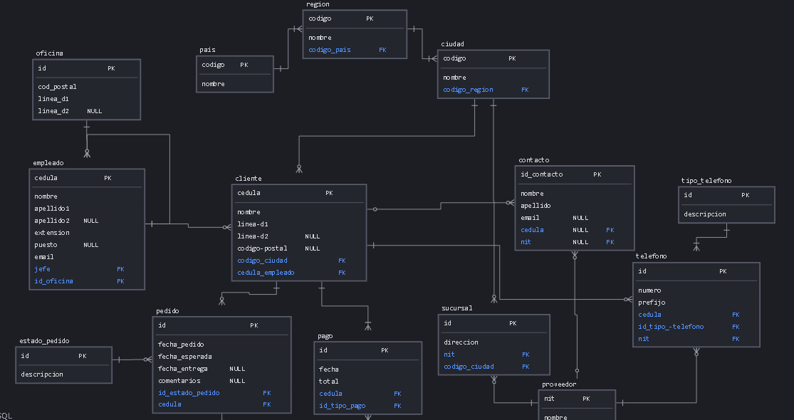
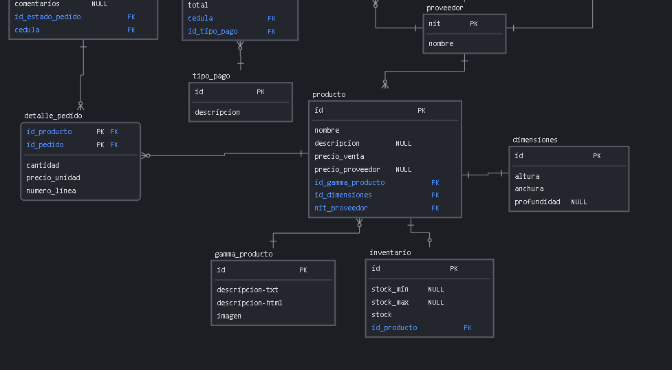
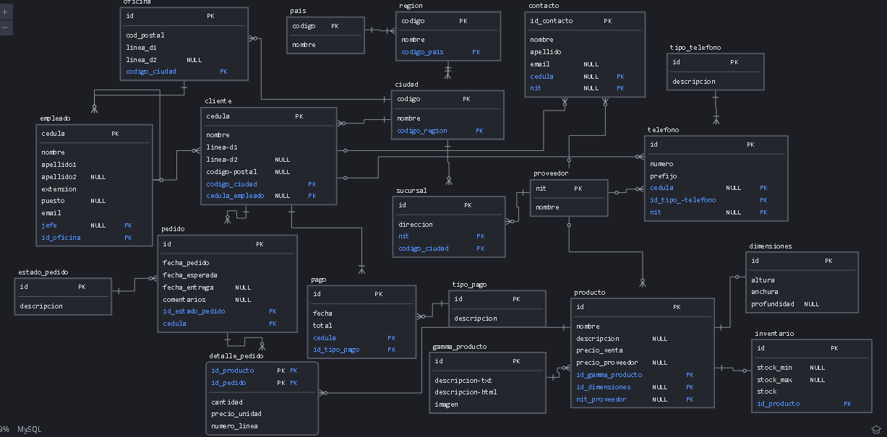

DDL

Creacion de la base de datos:

```mysql
create database tallerNormalizacion;
```

Creacion de las tablas:

```mysql
create table pais(
    id int auto_increment primary key,
    nombre varchar(100) not null
);

create table region(
	id int auto_increment primary key,
	nombre varchar(100) not null,
    id_pais int not null,
    constraint FK_id_pais foreign key(id_pais) references pais(id)
);

create table ciudad(
	id int auto_increment primary key,
	nombre varchar(100) not null,
	id_region int  not null,
	constraint FK_id_region foreign key(id_region) references region(id)
);

create table oficina(
	id int auto_increment primary key,
    cod_postal int(6) not null,
    linea_d1 varchar(100) not null,
    linea_d2 varchar(100),
    id_ciudad int,
    constraint FK_id_ciudad_oficina foreign key(id_ciudad) references ciudad(id)
);

create table empleado(
	cedula int not null primary key,
    nombre varchar(100) not null,
    apellido1 varchar(100) not null,
    apellido2 varchar(100),
    extension int(5) not null,
    puesto varchar(100),
    email varchar(100) not null,
    jefe int,
    id_oficina int,
    constraint FK_cedula_jefe foreign key(jefe) references empleado(cedula),
    constraint FK_id_oficina foreign key(id_oficina) references oficina(id)
);

create table cliente(
    cedula int(10) primary key,
	nombre varchar(100) not null,
	linea_d1 varchar(100) not null,
    linea_d2 varchar(100),
    id_ciudad int not null,
    cedula_empleado int,
    constraint FK_id_ciudad_cliente foreign key(id_ciudad) references ciudad(id),
    constraint FK_id_empleado foreign key(cedula_empleado) references empleado(cedula)
);

create table proveedor(
	nit int(9) primary key,
    nombre varchar(100) not null
);

create table sucursal(
	id int auto_increment primary key,
    direccion varchar(100) not null,
    nit_proveedor int not null,
    id_ciudad int not null,
    constraint FK_nit_proveedor_sucursal foreign key(nit_proveedor) references proveedor(nit),
    constraint FK_id_ciudad_sucursal foreign key(id_ciudad) references ciudad(id)
);

create table tipo_telefono(
	id int auto_increment primary key,
    descripcion varchar(100) not null
);

create table telefono(
    id int auto_increment primary key,
    numero int(15) not null,
    prefijo int(5) not null,
    cedula_cliente int(10) null,
    id_tipo_telefono int not null,
    nit_proveedor int(9) null,
    id_oficina int null,
    constraint FK_id_oficina_telefono foreign key(id_oficina) references oficina(id),
    constraint FK_cedula_cliente_telefono foreign key(cedula_cliente) references cliente(cedula),
    constraint FK_nit_proveedor_telefono foreign key(nit_proveedor) references proveedor(nit),
    constraint FK_id_tipo_telefono foreign key(id_tipo_telefono) references tipo_telefono(id)
);

create table tipo_pago(
	id int auto_increment primary key,
    descripcion varchar(100) not null
);

create table pago(
	id int auto_increment primary key,
    fecha date not null,
    total double not null,
    cedula_cliente int(10) not null,
    id_tipo_pago int not null,
    constraint FK_cedula_cliente_pago foreign key(cedula_cliente) references cliente(cedula),
    constraint FK_id_tipo_pago foreign key(id_tipo_pago) references tipo_pago(id)
);

create table contacto(
	id int auto_increment primary key,
    nombre varchar(100) not null,
    apellido varchar(100) not null,
    email varchar(50) null,
    cedula_cliente int(10) null,
    nit_proveedor int(9) null,
    constraint FK_cedula_cliente_contacto foreign key(cedula_cliente) references cliente(cedula),
    constraint FK_nit_proveedor_contacto foreign key(nit_proveedor) references proveedor(nit)
);

create table estado_pedido(
	id int auto_increment primary key,
    descripcion varchar(100) not null 
);

create table gamma_producto(
	id int auto_increment primary key,
    descripcion_txt varchar(200) not null,
    descripcion_html varchar(200) not null,
    imagen varchar(100) not null
);

create table dimensiones(
	id int auto_increment primary key,
    largo int(4) not null,
    ancho int(4) not null,
    alto int(4) null
);

create table producto(
	id int auto_increment primary key,
    nombre varchar(100) not null,
    descripcion varchar(200) null,
    precio_venta double not null,
    precio_proveedor double null,
    id_gamma_producto int not null,
    id_dimensiones int null,
    nit_proveedor int(9) null,
    constraint FK_id_gamma_producto foreign key(id_gamma_producto) references gamma_producto(id),
    constraint FK_id_dimensiones foreign key(id_dimensiones) references dimensiones(id),
    constraint FK_nit_proveedor_prodcuto foreign key(nit_proveedor) references proveedor(nit)
);

create table inventario(
	id int auto_increment primary key,
    stock_mininmo int(6) null,
    stock_maximo int(6) null,
    stock_actual int(6) not null,
    id_producto int not null,
    constraint FK_id_producto_inventario foreign key(id_producto) references producto(id)
);

create table pedido(
	id int auto_increment primary key,
    fecha_pedido date not null,
    fecha_esperada date not null,
    fecha_entrega date null,
    comentarios varchar(200) null,
    id_estado_pedido int not null,
    cedula_cliente int(10) not null,
    constraint FK_cedula_cliente_peido foreign key(cedula_cliente) references cliente(cedula),
    constraint FK_id_estado_pedido foreign key(id_estado_pedido) references estado_pedido(id)
);

create table detalle_pedido(
	id_producto int not null,
    id_pedido int not null,
    cantidad int(6) not null,
    precio_unidad double not null,
    numero_linea int(6) not null,
    primary key(id_producto,id_pedido),
    constraint FK_id_producto_detalle_pedido foreign key(id_producto) references producto(id),
    constraint FK_id_pedido_detalle_pedido foreign key(id_pedido) references pedido(id)
);
```


**DML**

**INSERT**

```mysql
-- Países
INSERT INTO pais (nombre) VALUES 
('España'), 
('Francia'), 
('Alemania'), 
('Italia'), 
('Portugal'), 
('Reino Unido'), 
('Suiza'), 
('Suecia'), 
('Noruega'), 
('Finlandia');

-- Regiones
INSERT INTO region (nombre, id_pais) VALUES 
('Comunidad de Madrid', 1), 
('Cataluña', 1), 
('Île-de-France', 2), 
('Baviera', 3), 
('Lombardía', 4), 
('Lisboa', 5), 
('Inglaterra', 6), 
('Zurich', 7), 
('Estocolmo', 8), 
('Oslo', 9);

-- Ciudades
INSERT INTO ciudad (nombre, id_region) VALUES 
('Madrid', 1), 
('Barcelona', 1), 
('París', 3), 
('Munich', 4), 
('Milán', 5), 
('Lisboa', 6), 
('Londres', 7), 
('Zúrich', 8), 
('Estocolmo', 9), 
('Oslo', 10);

-- Oficinas
INSERT INTO oficina (cod_postal, linea_d1, id_ciudad) VALUES 
(28001, 'Calle Gran Vía, 10', 1), 
(08001, 'Calle Diagonal, 20', 2), 
(75001, 'Avenue des Champs-Élysées, 30', 3), 
(80333, 'Karlstraße, 40', 4), 
(20121, 'Via Montenapoleone, 50', 5), 
(1000, 'Rua Augusta, 60', 6), 
(1213, 'Fleet Street, 70', 7), 
(8001, 'Bahnhofstrasse, 80', 8),
(11446, 'Sveavägen, 90', 9), 
(167, 'Karl Johans gate, 100', 10);

-- Empleados
INSERT INTO empleado (cedula, nombre, apellido1, apellido2, extension, puesto, email, jefe, id_oficina) VALUES 
(1234567890, 'Juan', 'González', 'Pérez', 12345, 'Gerente', 'juan@email.com', NULL, 1), 
(1234567891, 'María', 'López', 'Martínez', 23456, 'Vendedor', 'maria@email.com', 1234567890, 2), 
(1234567892, 'Carlos', 'Rodríguez', 'Gómez', 34567, 'Asistente', 'carlos@email.com', 1234567890, 1), 
(1234567893, 'Ana', 'Sánchez', 'García', 45678, 'Contador', 'ana@email.com', 1234567890, 2), 
(1234567894, 'Pedro', 'Martín', 'Fernández', 56789, 'Desarrollador', 'pedro@email.com', 1234567891, 1), 
(1234567895, 'Sara', 'Díaz', 'Álvarez', 67890, 'Analista', 'sara@email.com', 1234567891, 2), 
(1234567896, 'Luis', 'Ruiz', 'Jiménez', 78901, 'Diseñador', 'luis@email.com', 1234567890, 1), 
(1234567897, 'Elena', 'Pérez', 'Romero', 89012, 'Marketing', 'elena@email.com', 1234567890, 2),
(1234567898, 'Diego', 'Gómez', 'Hernández', 90123, 'Recepcionista', 'diego@email.com', 1234567892, 1), 
(1234567899, 'Laura', 'Fernández', 'Díaz', 12345, 'Recursos Humanos', 'laura@email.com', 1234567892, 2);

-- Clientes
INSERT INTO cliente (cedula, nombre, linea_d1, linea_d2, id_ciudad, cedula_empleado) VALUES 
(1122334455, 'John Doe', 'Calle 123', 'Piso 4', 1, 1234567890), 
(1122334456, 'Jane Smith', 'Avenida 456', 'Apartamento 2B', 2, 1234567891), 
(1122334457, 'Michael Johnson', 'Carrera 789', NULL, 3, 1234567892), 
(1122334458, 'Emily Davis', 'Calle 012', 'Oficina 7', 1, 1234567893), 
(1122334459, 'William Martinez', 'Avenida XYZ', 'Piso 10', 2, 1234567894), 
(1122334460, 'Sarah Brown', 'Calle 345', 'Apartamento 5A', 3, 1234567895), 
(1122334461, 'David Wilson', 'Carrera 678', NULL, 1, 1234567896), 
(1122334462, 'Olivia Taylor', 'Avenida 901', 'Oficina 3B', 2, 1234567897), 
(1122334463, 'Emma Anderson', 'Calle UVW', 'Piso 8', 3, 1234567898), 
(1122334464, 'James Wilson', 'Avenida 234', 'Apartamento 12C', 1, 1234567899);


-- Proveedores
INSERT INTO proveedor (nit, nombre) VALUES 
(123456789, 'Acme Corporation'),
(234567890, 'Smith & Co.'),
(345678901, 'Johnson Enterprises'),
(456789012, 'Martinez Ltd.'),
(567890123, 'Brown Industries'),
(678901234, 'Taylor Group'),
(789012345, 'Wilson & Sons'),
(890123456, 'Anderson Supplies'),
(901234567, 'Taylor & Martinez'),
(101234567, 'Johnson Corp.');


-- Sucursales
INSERT INTO sucursal (direccion, nit_proveedor, id_ciudad) VALUES 
('Calle 123, Local 1', 123456789, 1),
('Avenida 456, Piso 2', 234567890, 2),
('Carrera 789, Edificio A', 345678901, 3),
('Avenida XYZ, Torre B', 456789012, 1),
('Calle UVW, Bloque 3', 567890123, 2),
('Carrera 678, Oficina 5', 678901234, 3),
('Avenida 901, Local 10', 789012345, 1),
('Calle 012, Piso 3', 890123456, 2),
('Avenida 234, Edificio C', 901234567, 3),
('Calle 345, Torre D', 101234567, 1);


-- Tipo de Teléfono
INSERT INTO tipo_telefono (descripcion) VALUES 
('Móvil'), 
('Fijo'), 
('Fax'), 
('Trabajo'), 
('Casa');

-- Inserts de teléfonos para proveedores
INSERT INTO telefono (numero, prefijo, id_tipo_telefono, nit_proveedor)
VALUES 
(612345678, 1, 1, 101234567), -- Teléfono del proveedor Johnson Corp.
(623456789, 1, 2, 123456789), -- Teléfono del proveedor Acme Corporation
(634567890, 1, 1, 234567890), -- Teléfono del proveedor Smith & Co.
(645678901, 1, 2, 345678901), -- Teléfono del proveedor Johnson Enterprises
(656789012, 1, 1, 456789012), -- Teléfono del proveedor Martinez Ltd.
(667890123, 1, 2, 567890123), -- Teléfono del proveedor Brown Industries
(678901234, 1, 1, 678901234), -- Teléfono del proveedor Taylor Group
(689012345, 1, 2, 789012345), -- Teléfono del proveedor Wilson & Sons
(690123456, 1, 1, 890123456), -- Teléfono del proveedor Anderson Supplies
(601234567, 1, 2, 901234567); -- Teléfono del proveedor Taylor & Martinez

-- Inserts de teléfonos para oficinas
INSERT INTO telefono (numero, prefijo, id_tipo_telefono, id_oficina)
VALUES 
(912345678, 34, 1, 1), -- Teléfono de la oficina 1
(934567890, 34, 2, 2), -- Teléfono de la oficina 2
(945678901, 34, 1, 3), -- Teléfono de la oficina 3
(956789012, 34, 2, 4), -- Teléfono de la oficina 4
(967890123, 34, 1, 5), -- Teléfono de la oficina 5
(978901234, 34, 2, 6), -- Teléfono de la oficina 6
(989012345, 34, 1, 7), -- Teléfono de la oficina 7
(990123456, 34, 2, 8), -- Teléfono de la oficina 8
(901234567, 34, 1, 9), -- Teléfono de la oficina 9
(912345678, 34, 2, 10); -- Teléfono de la oficina 10

-- Inserts de teléfonos para clientes
INSERT INTO telefono (numero, prefijo, cedula_cliente, id_tipo_telefono)
VALUES 
(12345678, 57, 1122334455, 1), -- Teléfono de John Doe
(23456789, 57, 1122334456, 2), -- Teléfono de Jane Smith
(34567890, 57, 1122334457, 1), -- Teléfono de Michael Johnson
(45678901, 57, 1122334458, 1), -- Teléfono de Emily Davis
(56789012, 57, 1122334459, 2), -- Teléfono de William Martinez
(67890123, 57, 1122334460, 1), -- Teléfono de Sarah Brown
(78901234, 57, 1122334461, 1), -- Teléfono de David Wilson
(89012345, 57, 1122334462, 2), -- Teléfono de Olivia Taylor
(90123456, 57, 1122334463, 1), -- Teléfono de Emma Anderson
(12345678, 57, 1122334464, 2); -- Teléfono de James Wilson

-- Tipos de Pago
INSERT INTO tipo_pago (descripcion) VALUES 
('Efectivo'), 
('Tarjeta de Crédito'), 
('Transferencia Bancaria'), 
('PayPal'), 
('Cheque');

-- Pagos
INSERT INTO pago (fecha, total, cedula_cliente, id_tipo_pago) VALUES 
('2024-04-20', 150.00, 1122334455, 1),
('2024-04-19', 200.00, 1122334456, 2),
('2024-04-18', 100.00, 1122334457, 1),
('2024-04-17', 250.00, 1122334458, 2),
('2024-04-16', 300.00, 1122334459, 1),
('2024-04-15', 400.00, 1122334460, 2),
('2024-04-14', 200.00, 1122334461, 1),
('2024-04-13', 150.00, 1122334462, 2),
('2024-04-12', 100.00, 1122334463, 1),
('2024-04-11', 50.00, 1122334464, 2);


-- Contactos
INSERT INTO contacto (nombre, apellido, email, cedula_cliente, nit_proveedor) VALUES 
('Juan', 'Perez', 'juan.perez@example.com', 1122334455, NULL),
('Ana', 'Gomez', 'ana.gomez@example.com', 1122334456, NULL),
('Pedro', 'Rodriguez', 'pedro.rodriguez@example.com', 1122334457, NULL),
('Maria', 'Lopez', 'maria.lopez@example.com', 1122334458, NULL),
('Luis', 'Garcia', 'luis.garcia@example.com', 1122334459, NULL),
('Laura', 'Martinez', 'laura.martinez@example.com', 1122334460, NULL),
('Carlos', 'Sanchez', 'carlos.sanchez@example.com', 1122334461, NULL),
('Sofia', 'Diaz', 'sofia.diaz@example.com', 1122334462, NULL),
('Pablo', 'Hernandez', 'pablo.hernandez@example.com', 1122334463, NULL),
('Elena', 'Torres', 'elena.torres@example.com', 1122334464, NULL),
('Manuel', 'Gutierrez', 'manuel.gutierrez@example.com', NULL, 123456789),
('Marta', 'Fernandez', 'marta.fernandez@example.com', NULL, 234567890),
('Roberto', 'Ruiz', 'roberto.ruiz@example.com', NULL, 345678901),
('Carmen', 'Santos', 'carmen.santos@example.com', NULL, 456789012),
('Javier', 'Morales', 'javier.morales@example.com', NULL, 567890123),
('Isabel', 'Jimenez', 'isabel.jimenez@example.com', NULL, 678901234),
('Diego', 'Alvarez', 'diego.alvarez@example.com', NULL, 789012345),
('Lucia', 'Nunez', 'lucia.nunez@example.com', NULL, 890123456),
('Eva', 'Garcia', 'eva.garcia@example.com', NULL, 901234567),
('Antonio', 'Romero', 'antonio.romero@example.com', NULL, 101234567);


-- Estados de Pedido
INSERT INTO estado_pedido (descripcion) VALUES 
('En Proceso'), 
('En Ruta'), 
('Entregado'), 
('Cancelado');

-- Gamas de Producto
INSERT INTO gamma_producto (descripcion_txt, descripcion_html, imagen) VALUES 
('Electrónica', '<b>Electrónica</b>', 'electronica.jpg'), 
('Ropa', '<b>Ropa</b>', 'ropa.jpg'), 
('Hogar', '<b>Hogar</b>', 'hogar.jpg'), 
('Alimentación', '<b>Alimentación</b>', 'alimentacion.jpg'), 
('Belleza', '<b>Belleza</b>', 'belleza.jpg'), 
('Deporte', '<b>Deporte</b>', 'deporte.jpg'), 
('Juguetes', '<b>Juguetes</b>', 'juguetes.jpg'), 
('Libros', '<b>Libros</b>', 'libros.jpg'), 
('Herramientas', '<b>Herramientas</b>', 'herramientas.jpg'), 
('Automoción', '<b>Automoción</b>', 'automocion.jpg');

-- Dimensiones
INSERT INTO dimensiones (largo, ancho, alto) VALUES 
(10, 20, 5), 
(30, 40, 15), 
(20, 15, 10), 
(25, 35, 20), 
(40, 30, 25), 
(15, 25, 10), 
(35, 45, 30), 
(50, 40, 35), 
(45, 55, 25), 
(60, 50, 40);

-- Productos
INSERT INTO producto (nombre, descripcion, precio_venta, precio_proveedor, id_gamma_producto, id_dimensiones, nit_proveedor) VALUES 
('Laptop Lenovo', 'Portátil de alto rendimiento', 1200.00, 900.00, 1, 1, 123456789),
('Smartphone Samsung', 'Teléfono inteligente con pantalla OLED', 800.00, 600.00, 2, 2, 234567890),
('TV Sony', 'Televisor 4K de última generación', 1500.00, 1200.00, 3, 3, 345678901),
('Impresora HP', 'Impresora multifuncional inalámbrica', 300.00, 200.00, 1, 1, 456789012),
('Tablet Apple', 'Tableta con pantalla Retina', 700.00, 500.00, 2, 2, 567890123),
('Monitor Dell', 'Monitor de alta definición', 400.00, 300.00, 3, 3, 678901234),
('Altavoces Logitech', 'Sistema de altavoces envolvente', 150.00, 100.00, 1, 1, 789012345),
('Cámara Canon', 'Cámara réflex digital profesional', 1000.00, 800.00, 2, 2, 890123456),
('Router TP-Link', 'Router Wi-Fi de doble banda', 80.00, 50.00, 3, 3, 901234567),
('Teclado Razer', 'Teclado mecánico para gaming', 120.00, 90.00, 1, 1, 101234567);


-- Inventario
INSERT INTO inventario (stock_mininmo, stock_maximo, stock_actual, id_producto) VALUES 
(10, 100, 50, 1), 
(20, 200, 100, 2), 
(5, 50, 20, 3), 
(30, 300, 150, 4), 
(15, 150, 80, 5), 
(25, 250, 120, 6), 
(8, 80, 40, 7), 
(40, 400, 200, 8),
(12, 120, 60, 9), 
(50, 500, 250, 10);

-- Pedidos
INSERT INTO pedido (fecha_pedido, fecha_esperada, fecha_entrega, comentarios, id_estado_pedido, cedula_cliente) VALUES 
('2024-04-01', '2024-04-08', '2024-04-09', 'Pedido urgente', 1, 1122334455),
('2024-04-02', '2024-04-09', NULL, 'Envío pendiente de confirmación', 2, 1122334456),
('2024-04-03', '2024-04-10', '2024-04-11', NULL, 3, 1122334457),
('2024-04-04', '2024-04-11', NULL, 'Productos agotados, se reprogramará entrega', 1, 1122334458),
('2024-04-05', '2024-04-12', '2024-04-14', 'Pedido para evento corporativo', 2, 1122334459),
('2024-04-06', '2024-04-13', NULL, 'Envío retrasado por condiciones climáticas', 3, 1122334460),
('2024-04-07', '2024-04-14', '2024-04-15', NULL, 1, 1122334461),
('2024-04-08', '2024-04-15', '2024-04-16', 'Entrega confirmada por el cliente', 2, 1122334462),
('2024-04-09', '2024-04-16', NULL, 'Productos dañados en tránsito, se solicita reemplazo', 3, 1122334463),
('2024-04-10', '2024-04-17', '2024-04-18', 'Pedido estándar', 1, 1122334464);


-- Detalles de Pedido
INSERT INTO detalle_pedido (id_producto, id_pedido, cantidad, precio_unidad, numero_linea) VALUES 
(1, 1, 2, 250.00, 1), 
(2, 2, 3, 30.00, 2), 
(3, 3, 1, 150.00, 3), 
(4, 4, 5, 10.00, 4), 
(5, 5, 2, 20.00, 5), 
(6, 6, 3, 25.00, 6), 
(7, 7, 1, 50.00, 7), 
(8, 8, 4, 15.00, 8),
(9, 9, 2, 80.00, 9), 
(10, 10, 3, 100.00, 10);
```

**Consultas sobre una tabla**

1. Devuelve un listado con el código de oficina y la ciudad donde hay oficinas.

   ```mysql
   select o.id as "Codigo Oficina", c.nombre from oficina o join ciudad c on o.id_ciudad = c.id
   ```

   

2. Devuelve un listado con la ciudad y el teléfono de las oficinas de España.

   

   ```mysql
   select c.nombre as "Nombre de la Ciudad", CONCAT(t.prefijo," + ",t.numero) as "Numero de Oficina"
       from ciudad c
       join oficina o on o.id_ciudad = c.id
       join telefono t on t.id_oficina = o.id
       join region r on r.id = c.id_region
       join pais p on p.id = r.id_pais
       where p.nombre like "%spana";
   
   +---------------------+-------------------+
   | Nombre de la Ciudad | Numero de Oficina |
   +---------------------+-------------------+
   | Madrid              | 34 + 912345678    |
   | Barcelona           | 34 + 934567890    |
   +---------------------+-------------------+
   2 rows in set (0.00 sec)
   
   ```

   

3. Devuelve un listado con el nombre, apellidos y email de los empleados cuyo
   jefe tiene un código de jefe igual a 7.

  (Profe dado que la PK es la cedula no va a encontrar nada asi que voy a hacer la consulta con una cedula que haya ingresado: 1234567890 )

  

  ```mysql
select e.nombre as "Nombre Empleado", concat(e.apellido1,' ',ifnull(apellido2,'')) as "Apellidos Empleado", e.email as Email
from empleado e
where e.jefe = "1234567890";

+-----------------+--------------------+------------------+
| Nombre Empleado | Apellidos Empleado | Email            |
+-----------------+--------------------+------------------+
| María           | López Martínez     | maria@email.com  |
| Carlos          | Rodríguez Gómez    | carlos@email.com |
| Ana             | Sánchez García     | ana@email.com    |
| Luis            | Ruiz Jiménez       | luis@email.com   |
| Elena           | Pérez Romero       | elena@email.com  |
+-----------------+--------------------+------------------+
5 rows in set (0.01 sec)
  ```

  

4. Devuelve el nombre del puesto, nombre, apellidos y email del jefe de la
   empresa.

  

  ```mysql
select e.nombre as "Nombre Empleado", concat(e.apellido1,' ',ifnull(apellido2,'')) as "Apellidos Empleado", e.email as Email
from empleado e
where puesto like "gerente";

+-----------------+--------------------+----------------+
| Nombre Empleado | Apellidos Empleado | Email          |
+-----------------+--------------------+----------------+
| Juan            | González Pérez     | juan@email.com |
+-----------------+--------------------+----------------+
1 row in set (0.00 sec)
  ```

  

5. Devuelve un listado con el nombre, apellidos y puesto de aquellos
   empleados que no sean representantes de ventas.

  

  ```mysql
select e.nombre as "Nombre Empleado", concat(e.apellido1,' ',ifnull(apellido2,'')) as "Apellidos Empleado", e.puesto as Puesto
from empleado e
where puesto not like "vendedor" or "representante de ventas";

+-----------------+--------------------+------------------+
| Nombre Empleado | Apellidos Empleado | Puesto           |
+-----------------+--------------------+------------------+
| Juan            | González Pérez     | Gerente          |
| Carlos          | Rodríguez Gómez    | Asistente        |
| Ana             | Sánchez García     | Contador         |
| Pedro           | Martín Fernández   | Desarrollador    |
| Sara            | Díaz Álvarez       | Analista         |
| Luis            | Ruiz Jiménez       | Diseñador        |
| Elena           | Pérez Romero       | Marketing        |
| Diego           | Gómez Hernández    | Recepcionista    |
| Laura           | Fernández Díaz     | Recursos Humanos |
+-----------------+--------------------+------------------+
9 rows in set, 1 warning (0.00 sec)
  ```

  

6. Devuelve un listado con el nombre de los todos los clientes españoles.

   

   ```mysql
   	select c.nombre from cliente c 
   	join ciudad cd on cd.id = c.id_ciudad
   	join region r on r.id = cd.id_region
   	join pais p on p.id = r.id_pais
   	where p.nombre like "espana";
   
   +------------------+
   | nombre           |
   +------------------+
   | John Doe         |
   | Emily Davis      |
   | David Wilson     |
   | James Wilson     |
   | Jane Smith       |
   | William Martinez |
   | Olivia Taylor    |
   +------------------+
   ```

   

7. Devuelve un listado con los distintos estados por los que puede pasar un
   pedido.

  

  ```mysql
select descripcion
from estado_pedido;

+-------------+
| descripcion |
+-------------+
| En Proceso  |
| En Ruta     |
| Entregado   |
| Cancelado   |
+-------------+
  ```

  

8. Devuelve un listado con el código de cliente de aquellos clientes que
   realizaron algún pago en 2008. Tenga en cuenta que deberá eliminar
   aquellos códigos de cliente que aparezcan repetidos. Resuelva la consulta:
   • Utilizando la función YEAR de MySQL.
   • Utilizando la función DATE_FORMAT de MySQL.
   • Sin utilizar ninguna de las funciones anteriores.

  

  ```mysql
YEAR
	select distinct c.nombre 
	from cliente c
	join pedido p on p.cedula_cliente = c.cedula
	where year(p.fecha_pedido) = 2008;
	

	
	+--------------+
	| nombre       |
	+--------------+
	| David Wilson |
	| James Wilson |
	+--------------+

DATE_FORMAT

	select distinct c.nombre
	from cliente c
	join pedido p on p.cedula_cliente = c.cedula
	where date_format(p.fecha_pedido,"%Y") = 2008;

	+--------------+
	| nombre       |
	+--------------+
	| David Wilson |
	| James Wilson |
	+--------------+

SIN FUNCIONES ANTERIORES

	select distinct c.nombre
	from cliente c
	join pedido p on p.cedula_cliente = c.cedula
	where p.fecha_pedido like "%2008%";

	+--------------+
	| nombre       |
	+--------------+
	| David Wilson |
	| James Wilson |
	+--------------+
  ```

  

9. Devuelve un listado con el código de pedido, código de cliente, fecha
   esperada y fecha de entrega de los pedidos que no han sido entregados a
   tiempo.

  

  ```mysql
select p.id as "Codigo Pedido",
p.cedula_cliente as "Cedula Cliente",
p.fecha_esperada as "Fecha esperada",
p.fecha_entrega as "Fecha de Entrega"
from pedido p
where p.fecha_entrega > p.fecha_esperada;

	+---------------+----------------+----------------+------------------+
	| Codigo Pedido | Cedula Cliente | Fecha esperada | Fecha de Entrega |
	+---------------+----------------+----------------+------------------+
	|             1 |     1122334455 | 2024-04-08     | 2024-04-09       |
	|             3 |     1122334457 | 2024-04-10     | 2024-04-11       |
	|             5 |     1122334459 | 2024-04-12     | 2024-04-14       |
	|             7 |     1122334461 | 2024-04-14     | 2024-04-15       |
	|             8 |     1122334462 | 2024-04-15     | 2024-04-16       |
	|            10 |     1122334464 | 2024-04-17     | 2024-04-18       |
	+---------------+----------------+----------------+------------------+
  ```

  

10. Devuelve un listado con el código de pedido, código de cliente, fecha
    esperada y fecha de entrega de los pedidos cuya fecha de entrega ha sido al
    menos dos días antes de la fecha esperada.
    • Utilizando la función ADDDATE de MySQL.
    • Utilizando la función DATEDIFF de MySQL.
    • ¿Sería posible resolver esta consulta utilizando el operador de suma + o
    resta -?

    

    ```mysql
    modificaremos los registros de la tabla para que la consulta nos de resultados.
    
    update pedido
    set fecha_entrega = fecha_entrega - 3
    where id in (1,3); 
    
    DATE_ADD
    
    	select p.id as "Codigo Pedido",
    	p.cedula_cliente as "Cedula Cliente",
    	p.fecha_esperada as "Fecha esperada",
    	p.fecha_entrega as "Fecha de Entrega"
    	from pedido p
    	where date_add(p.fecha_entrega, interval 2 day) = p.fecha_esperada;
    	
    	+---------------+----------------+----------------+------------------+
    	| Codigo Pedido | Cedula Cliente | Fecha esperada | Fecha de Entrega |
    	+---------------+----------------+----------------+------------------+
    	|             1 |     1122334455 | 2024-04-08     | 2024-04-06       |
    	|             3 |     1122334457 | 2024-04-10     | 2024-04-08       |
    	+---------------+----------------+----------------+------------------+
    
    DATEDIFF
    
    
    	select p.id as "Codigo Pedido",
    	p.cedula_cliente as "Cedula Cliente",
    	p.fecha_esperada as "Fecha esperada",
    	p.fecha_entrega as "Fecha de Entrega"
    	from pedido p
    	where datediff(p.fecha_esperada, p.fecha_entrega) = 2;
    	
    	+---------------+----------------+----------------+------------------+
    	| Codigo Pedido | Cedula Cliente | Fecha esperada | Fecha de Entrega |
    	+---------------+----------------+----------------+------------------+
    	|             1 |     1122334455 | 2024-04-08     | 2024-04-06       |
    	|             3 |     1122334457 | 2024-04-10     | 2024-04-08       |
    	+---------------+----------------+----------------+------------------+
    
    CON + O -
    
    
    	select p.id as "Codigo Pedido",
    	p.cedula_cliente as "Cedula Cliente",
    	p.fecha_esperada as "Fecha esperada",
    	p.fecha_entrega as "Fecha de Entrega"
    	from pedido p
    	where (p.fecha_esperada - p.fecha_entrega) = 2;
    	
    	+---------------+----------------+----------------+------------------+
    	| Codigo Pedido | Cedula Cliente | Fecha esperada | Fecha de Entrega |
    	+---------------+----------------+----------------+------------------+
    	|             1 |     1122334455 | 2024-04-08     | 2024-04-06       |
    	|             3 |     1122334457 | 2024-04-10     | 2024-04-08       |
    	+---------------+----------------+----------------+------------------+
    	
    
    	select p.id as "Codigo Pedido",
    	p.cedula_cliente as "Cedula Cliente",
    	p.fecha_esperada as "Fecha esperada",
    	p.fecha_entrega as "Fecha de Entrega"
    	from pedido p
    	where (p.fecha_entrega + 2) = p.fecha_esperada;
    	
    	+---------------+----------------+----------------+------------------+
    	| Codigo Pedido | Cedula Cliente | Fecha esperada | Fecha de Entrega |
    	+---------------+----------------+----------------+------------------+
    	|             1 |     1122334455 | 2024-04-08     | 2024-04-06       |
    	|             3 |     1122334457 | 2024-04-10     | 2024-04-08       |
    	+---------------+----------------+----------------+------------------+
    ```

    

11. Devuelve un listado de todos los pedidos que fueron rechazados en 2009.

    

    ```mysql
    	alteraremos los registros para que la consulta nos de resultados
    
    	insert into estado_pedido(descripcion) values ("Rechazado");
    
    	update pedido
    	set id_estado_pedido = 5
    	where id in (10,9);
    	
    	select p.id as "Codigo Pedido",
    	p.fecha_pedido as "Fecha de Pedido",
    	p.fecha_entrega as "Fecha de Entrega",
    	p.fecha_esperada as "Fecha Esperada",
    	p.comentarios as "Comentarios",
    	ep.descripcion as "Estado del Pedido",
    	p.cedula_cliente as "Cedula Cliente"
    	from pedido p
    	join estado_pedido ep on ep.id = p.id_estado_pedido
    	where ep.descripcion = "Rechazado"
    	
    	+---------------+-----------------+------------------+----------------+--------------------------------------------------------+-------------------+----------------+
    | Codigo Pedido | Fecha de Pedido | Fecha de Entrega | Fecha Esperada | Comentarios                                            | Estado del Pedido | Cedula Cliente |
    +---------------+-----------------+------------------+----------------+--------------------------------------------------------+-------------------+----------------+
    |    9 | 2024-04-09 | NULL      | 2024-04-16| Productos dañados en tránsito, se solicita reemplazo | Rechazado|     1122334463 |
    |    10 | 2024-04-10 | 2024-04-18 | 2024-04-17| Pedido estándar                                   | Rechazado|     1122334464 |
    +---------------+-----------------+------------------+----------------+--------------------------------------------------------+-------------------+----------------+
    ```

    

12. Devuelve un listado de todos los pedidos que han sido entregados en el
    mes de enero de cualquier año.

    

    ```mysql
    se modifican los registros.
    	
    	update pedido
    	set fecha_pedido = date_sub(fecha_pedido,interval 3 month)
    	where id in (9,10);
    
    	select p.id as "Codigo Pedido",
    	p.fecha_pedido as "Fecha de Pedido",
    	p.fecha_entrega as "Fecha de Entrega",
    	p.fecha_esperada as "Fecha Esperada",
    	p.comentarios as "Comentarios",
    	ep.descripcion as "Estado del Pedido",
    	p.cedula_cliente as "Cedula Cliente",
    	date_format(p.fecha_pedido, "%M") as mes
    	from pedido p 
    	join estado_pedido ep on ep.id = p.id_estado_pedido
    	where date_format(p.fecha_pedido, "%m") = 1
    	
    +---------------+-----------------+------------------+----------------+--------------------------------------------------------+-------------------+----------------+---------+
    | Codigo Pedido | Fecha de Pedido | Fecha de Entrega | Fecha Esperada | | Estado del Pedido | Cedula Cliente | mes     |
    +---------------+-----------------+------------------+----------------+--------------------------------------------------------+-------------------+----------------+---------+
    |            10 | 2008-01-10      | 2024-04-18       | 2024-04-17     | Pedido estándar                                        | En Proceso        |     1122334464 | January |
    |             9 | 2024-01-09      | NULL             | 2024-04-16     | Productos dañados en tránsito, se solicita reemplazo   | Entregado         |     1122334463 | January |
    +---------------+-----------------+------------------+----------------+--------------------------------------------------------+-------------------+----------------+---------+
    
    
    ```

    

13. Devuelve un listado con todos los pagos que se realizaron en el
    año 2008 mediante Paypal. Ordene el resultado de mayor a menor.

    

    ```mysql
    	update pago
    	set id_tipo_pago = 4, fecha = date_sub(fecha, interval 16 year)
    	where cedula_cliente in (1122334464, 1122334460);
    
    	select p.id as "Codigo Pago",
    	p.fecha as "Fecha Pago",
    	p.total as "Total del Pago",
    	p.cedula_cliente as "Cedula del Cliente",
    	tp.descripcion as "Tipo pago"
    	from pago p
    	join tipo_pago tp on tp.id = p.id_tipo_pago
    	where tp.descripcion like ("paypal") and date_format(p.fecha,"%Y") = 2008
    
    +-------------+------------+----------------+--------------------+-----------+
    | Codigo Pago | Fecha Pago | Total del Pago | Cedula del Cliente | Tipo pago |
    +-------------+------------+----------------+--------------------+-----------+
    |           6 | 2008-04-15 |            400 |         1122334460 | PayPal    |
    |          10 | 2008-04-11 |             50 |         1122334464 | PayPal    |
    +-------------+------------+----------------+--------------------+-----------+
    ```

    

14. Devuelve un listado con todas las formas de pago que aparecen en la
    tabla pago. Tenga en cuenta que no deben aparecer formas de pago
    repetidas.

    

    ```mysql
    select tp.id as "Codigo Forma de Pago", 
    tp.descripcion as "Tipo de pago"
    from tipo_pago tp;
    
    +----------------------+------------------------+
    | Codigo Forma de Pago | Tipo de pago           |
    +----------------------+------------------------+
    |                    1 | Efectivo               |
    |                    2 | Tarjeta de Crédito     |
    |                    3 | Transferencia Bancaria |
    |                    4 | PayPal                 |
    |                    5 | Cheque                 |
    +----------------------+------------------------+
    ```

    

15. Devuelve un listado con todos los productos que pertenecen a la
    gama Ornamentales y que tienen más de 100 unidades en stock. El listado
    deberá estar ordenado por su precio de venta, mostrando en primer lugar
    los de mayor precio.

    

    ```mysql
    Voy a cambiar la gamma de ornamentales por electronica
    	
    	select p.nombre as "Nombre Producto",
    	(ifnull(p.descripcion,"Sin desc")) as "Descripcion Producto",
    	p.precio_venta as "Precio de venta",
    	p.precio_proveedor as "Precio de Compra",
    	g.descripcion_txt as "Gamma Producto",
    	(concat(d.largo," x ",d.ancho, ifnull(concat(" x ",d.alto),""))) as "Dimensiones",
    	i.stock_actual as "Disponibles"
    	from producto p
    	join gamma_producto g on g.id = p.id_gamma_producto
    	join dimensiones d on d.id = p.id_dimensiones
    	join inventario i on i.id_producto = p.id
    	where g.descripcion_txt like ("electronica")
    	and i.stock_actual > 100
    	order by p.precio_venta desc;
    
    +-----------------+---------------------------------------+-----------------+------------------+----------------+-------------+-------------+
    | Nombre Producto | Descripcion Producto | Precio de venta | Precio de Compra | Gamma Producto | Dimensiones | Disponibles |
    +-----------------+---------------------------------------+-----------------+------------------+----------------+-------------+-------------+
    | Impresora HP    | Impresora multifuncional inalámbrica |   300 |           200 | Electrónica    | 10 x 20 x 5 |         150 |
    | Teclado Razer   | Teclado mecánico para gaming         |   120 |            90 | Electrónica    | 10 x 20 x 5 |         250 |
    +-----------------+---------------------------------------+-----------------+------------------+----------------+-------------+-------------+
    ```

    

16. Devuelve un listado con todos los clientes que sean de la ciudad de Madrid y
    cuyo representante de ventas tenga el código de empleado 11 o 30.

    

    ```mysql
    reemplazare el cod del empleado con su cedula (1234567893 o 1234567898)
    
    select c.cedula as "Cedula", c.nombre as "Nombre", c.linea_d1 as "Direccion 1", c.linea_d2 as  "Direccion 2", cd.nombre, c.cedula_empleado as "Representante Asignado"
    from cliente c
    join ciudad cd on cd.id = c.id_ciudad
    where c.cedula_empleado in (1234567893,1234567898);
    
    +------------+---------------+-------------+-------------+--------+------------------------+
    | Cedula     | Nombre        | Direccion 1 | Direccion 2 | nombre | Representante Asignado |
    +------------+---------------+-------------+-------------+--------+------------------------+
    | 1122334458 | Emily Davis   | Calle 012   | Oficina 7   | Madrid |             1234567893 |
    | 1122334463 | Emma Anderson | Calle UVW   | Piso 8      | París  |             1234567898 |
    +------------+---------------+-------------+-------------+--------+------------------------+
    ```

    

**Consultas multitabla (Composición interna)**
**Resuelva todas las consultas utilizando la sintaxis de SQL1 y SQL2. Las consultas con**
**sintaxis de SQL2 se deben resolver con INNER JOIN y NATURAL JOIN.**

1. Obtén un listado con el nombre de cada cliente y el nombre y apellido de su
   representante de ventas.

  

  ```mysql
select c.nombre as "Nombre Cliente", e.nombre as "Nombre Representante", concat(e.apellido1,' ',ifnull(e.apellido2,'')) as "Apellidos Representante"
from cliente c
join empleado e on e.cedula = c.cedula_empleado;

+------------------+----------------------+-------------------------+
| Nombre Cliente   | Nombre Representante | Apellidos Representante |
+------------------+----------------------+-------------------------+
| John Doe         | Juan                 | González Pérez          |
| Jane Smith       | María                | López Martínez          |
| Michael Johnson  | Carlos               | Rodríguez Gómez         |
| Emily Davis      | Ana                  | Sánchez García          |
| William Martinez | Pedro                | Martín Fernández        |
| Sarah Brown      | Sara                 | Díaz Álvarez            |
| David Wilson     | Luis                 | Ruiz Jiménez            |
| Olivia Taylor    | Elena                | Pérez Romero            |
| Emma Anderson    | Diego                | Gómez Hernández         |
| James Wilson     | Laura                | Fernández Díaz          |
+------------------+----------------------+-------------------------+
  ```

  

2. Muestra el nombre de los clientes que hayan realizado pagos junto con el
   nombre de sus representantes de ventas.

  

  ```mysql
select c.nombre as "Nombre Cliente", e.nombre as 'Nombre Representate', concat(e.apellido1,' ',ifnull(e.apellido2,'')) as 'Apellidos Representante'
from cliente c
join empleado e on e.cedula = c.cedula_empleado
join pago p on p.cedula_cliente = c.cedula;

+------------------+---------------------+-------------------------+
| Nombre Cliente   | Nombre Representate | Apellidos Representante |
+------------------+---------------------+-------------------------+
| John Doe         | Juan                | González Pérez          |
| Jane Smith       | María               | López Martínez          |
| Michael Johnson  | Carlos              | Rodríguez Gómez         |
| Emily Davis      | Ana                 | Sánchez García          |
| William Martinez | Pedro               | Martín Fernández        |
| Sarah Brown      | Sara                | Díaz Álvarez            |
| David Wilson     | Luis                | Ruiz Jiménez            |
| Olivia Taylor    | Elena               | Pérez Romero            |
| Emma Anderson    | Diego               | Gómez Hernández         |
| James Wilson     | Laura               | Fernández Díaz          |
+------------------+---------------------+-------------------------+
  ```

  

3. Muestra el nombre de los clientes que no hayan realizado pagos junto con
   el nombre de sus representantes de ventas.

 

  ```mysql
delete from pago where cedula_cliente = 1122334455;

select c.nombre as "Nombre Cliente", e.nombre as 'Nombre Representate', concat(e.apellido1,' ',ifnull(e.apellido2,'')) as 'Apellidos Representante'
from cliente c
join empleado e on e.cedula = c.cedula_empleado
where c.cedula not in (select p.cedula_cliente from pago p);

+----------------+---------------------+-------------------------+
| Nombre Cliente | Nombre Representate | Apellidos Representante |
+----------------+---------------------+-------------------------+
| John Doe       | Juan                | González Pérez          |
+----------------+---------------------+-------------------------+
  ```

  

4. Devuelve el nombre de los clientes que han hecho pagos y el nombre de sus
   representantes junto con la ciudad de la oficina a la que pertenece el
   representante.

  

  ```mysql
select c.nombre as "Nombre Cliente", e.nombre as 'Nombre Representate', concat(e.apellido1,' ',ifnull(e.apellido2,'')) as 'Apellidos Representante', cd.nombre
from cliente c
join empleado e on e.cedula = c.cedula_empleado
join oficina o on e.id_oficina = o.id
join ciudad cd on cd.id = o.id_ciudad
join pagos p on p.cedula_cliente = c.cedula;

+------------------+---------------------+-------------------------+------------------+
| Nombre Cliente   | Nombre Representate | Apellidos Representante | Nombre ciudad    |
+------------------+---------------------+-------------------------+------------------+
| John Doe         | Juan                | González Pérez          | Madrid           |
| Jane Smith       | María               | López Martínez          | Barcelona        |
| Michael Johnson  | Carlos              | Rodríguez Gómez         | Madrid           |
| Emily Davis      | Ana                 | Sánchez García          | Barcelona        |
| William Martinez | Pedro               | Martín Fernández        | Madrid           |
| Sarah Brown      | Sara                | Díaz Álvarez            | Barcelona        |
| David Wilson     | Luis                | Ruiz Jiménez            | Madrid           |
| Olivia Taylor    | Elena               | Pérez Romero            | Barcelona        |
| Emma Anderson    | Diego               | Gómez Hernández         | Madrid           |
| James Wilson     | Laura               | Fernández Díaz          | Barcelona        |
+------------------+---------------------+-------------------------+------------------+
  ```

  

5. Devuelve el nombre de los clientes que no hayan hecho pagos y el nombre
   de sus representantes junto con la ciudad de la oficina a la que pertenece el
   representante.

  

  ```mysql
delete from pago where cedula_cliente = 1122334455;

select c.nombre as "Nombre Cliente", e.nombre as 'Nombre Representate', concat(e.apellido1,' ',ifnull(e.apellido2,'')) as 'Apellidos Representante', cd.nombre
from cliente c
join empleado e on e.cedula = c.cedula_empleado
join oficina o on e.id_oficina = o.id
join ciudad cd on cd.id = o.id_ciudad
where c.cedula not in (select cedula_cliente from pago);

+----------------+---------------------+-------------------------+--------+
| Nombre Cliente | Nombre Representate | Apellidos Representante | nombre |
+----------------+---------------------+-------------------------+--------+
| John Doe       | Juan                | González Pérez          | Madrid |
+----------------+---------------------+-------------------------+--------+
  ```

  

6. Lista la dirección de las oficinas que tengan clientes en Fuenlabrada.

   

   ```mysql
   select o.linea_d1
   from oficina o
   inner join empleado e on o.id = e.id_oficina
   inner join cliente c on e.cedula = c.cedula_empleado
   inner join ciudad ci on o.id_ciudad = ci.id
   where ci.nombre like 'Fuenlabrada';
   ```

   

7. Devuelve el nombre de los clientes y el nombre de sus representantes junto
   con la ciudad de la oficina a la que pertenece el representante.

  

  ```mysql
select c.nombre as cliente, 
       concat(e.nombre, ' ', e.apellido1) as representante, 
       ci.nombre as ciudad_oficina
from cliente c
join empleado e on c.cedula_empleado = e.cedula
join oficina o on e.id_oficina = o.id
join ciudad ci on o.id_ciudad = ci.id;

+------------------+-------------------+----------------+
| cliente          | representante     | ciudad_oficina |
+------------------+-------------------+----------------+
| John Doe         | Juan González     | Madrid         |
| Jane Smith       | María López       | Barcelona      |
| Michael Johnson  | Carlos Rodríguez  | Madrid         |
| Emily Davis      | Ana Sánchez       | Barcelona      |
| William Martinez | Pedro Martín      | Madrid         |
| Sarah Brown      | Sara Díaz         | Barcelona      |
| David Wilson     | Luis Ruiz         | Madrid         |
| Olivia Taylor    | Elena Pérez       | Barcelona      |
| Emma Anderson    | Diego Gómez       | Madrid         |
| James Wilson     | Laura Fernández   | Barcelona      |
+------------------+-------------------+----------------+
  ```

  

8. Devuelve un listado con el nombre de los empleados junto con el nombre
   de sus jefes.

  

  ```mysql
select e1.nombre as empleado, 
       concat(e2.nombre, ' ', e2.apellido1) as jefe
from empleado e1
left join empleado e2 on e1.jefe = e2.cedula;

+----------+-------------------+
| empleado | jefe              |
+----------+-------------------+
| Juan     | NULL              |
| María    | Juan González     |
| Carlos   | Juan González     |
| Ana      | Juan González     |
| Pedro    | María López       |
| Sara     | María López       |
| Luis     | Juan González     |
| Elena    | Juan González     |
| Diego    | Carlos Rodríguez  |
| Laura    | Carlos Rodríguez  |
+----------+-------------------+
  ```

  

9. Devuelve un listado que muestre el nombre de cada empleados, el nombre
   de su jefe y el nombre del jefe de sus jefe.

  

  ```mysql
select e1.nombre as empleado,
       concat(e2.nombre, ' ', e2.apellido1) as jefe,
       concat(e3.nombre, ' ', e3.apellido1) as jefe_de_jefe
from empleado e1
left join empleado e2 on e1.jefe = e2.cedula
left join empleado e3 on e2.jefe = e3.cedula;


+----------+-------------------+----------------+
| empleado | jefe              | jefe_de_jefe   |
+----------+-------------------+----------------+
| Juan     | NULL              | NULL           |
| María    | Juan González     | NULL           |
| Carlos   | Juan González     | NULL           |
| Ana      | Juan González     | NULL           |
| Pedro    | María López       | Juan González  |
| Sara     | María López       | Juan González  |
| Luis     | Juan González     | NULL           |
| Elena    | Juan González     | NULL           |
| Diego    | Carlos Rodríguez  | Juan González  |
| Laura    | Carlos Rodríguez  | Juan González  |
+----------+-------------------+----------------+
  ```

  

10. Devuelve el nombre de los clientes a los que no se les ha entregado a
    tiempo un pedido.

    

    ```mysql
    select distinct c.nombre
    from cliente c
    left join pedido p on c.cedula = p.cedula_cliente
    where p.fecha_entrega > p.fecha_esperada or p.fecha_entrega is null;
    
    +------------------+
    | nombre           |
    +------------------+
    | John Doe         |
    | Jane Smith       |
    | Michael Johnson  |
    | Emily Davis      |
    | William Martinez |
    | Sarah Brown      |
    | David Wilson     |
    | Olivia Taylor    |
    | Emma Anderson    |
    | James Wilson     |
    +------------------+
    ```

    

11. Devuelve un listado de las diferentes gamas de producto que ha comprado
    cada cliente.

    

    ```mysql
    select distinct c.nombre, gp.descripcion_txt
    from cliente c
     join pedido pd on c.cedula = pd.cedula_cliente
     join detalle_pedido dp on pd.id = dp.id_pedido
     join producto p on dp.id_producto = p.id
     join gamma_producto gp on p.id_gamma_producto = gp.id;
    
    
    +------------------+-----------------+
    | nombre           | descripcion_txt |
    +------------------+-----------------+
    | John Doe         | Electrónica     |
    | Jane Smith       | Ropa            |
    | Michael Johnson  | Hogar           |
    | Emily Davis      | Electrónica     |
    | William Martinez | Ropa            |
    | Sarah Brown      | Hogar           |
    | David Wilson     | Electrónica     |
    | Olivia Taylor    | Ropa            |
    | Emma Anderson    | Hogar           |
    | James Wilson     | Electrónica     |
    +------------------+-----------------+
    ```

    

    Consultas multitabla (Composición externa)
    Resuelva todas las consultas utilizando las cláusulas LEFT JOIN, RIGHT JOIN, NATURAL
    LEFT JOIN y NATURAL RIGHT JOIN.

    

12. Devuelve un listado que muestre solamente los clientes que no han realizado ningún pago.

   

   ```mysql
select c.cedula ,c.nombre
from cliente c
left join pago p on c.cedula = p.cedula_cliente
where p.id is null;

   ```

   

13. Devuelve un listado que muestre solamente los clientes que no han
      realizado ningún pedido.

   

   ```mysql
select c.cedula, c.nombre
from cliente c
left join pedido p on c.cedula = p.cedula_cliente
where p.id is null;

   ```

   

14. Devuelve un listado que muestre los clientes que no han realizado ningún
      pago y los que no han realizado ningún pedido.

   

   ```mysql
SELECT DISTINCT c.cedula, c.nombre, c.linea_d1, c.linea_d2, c.id_ciudad, c.cedula_empleado 
FROM cliente c 
LEFT JOIN pago p ON c.cedula = p.cedula_cliente 
LEFT JOIN pedido pe ON c.cedula = pe.cedula_cliente 
WHERE p.cedula_cliente IS NULL AND pe.cedula_cliente IS NULL;

   ```

   

15. Devuelve un listado que muestre solamente los empleados que no tienen
      una oficina asociada.

   

   ```mysql
select c.cedula, c.nombre, c.linea_d1, c.linea_d2, c.id_ciudad, c.cedula_empleado 
from cliente c 
left join pago p on c.cedula = p.cedula_cliente 
left join pedido pe on c.cedula = pe.cedula_cliente 
where p.cedula_cliente is null and pe.cedula_cliente is null;
select cedula, nombre from empleado
where id_oficina is null;

   ```

   

16. Devuelve un listado que muestre solamente los empleados que no tienen un
      cliente asociado.

   

   ```mysql
select e.nombre, e.apellido1, e.apellido2
from empleado e
left join cliente c on e.cedula = c.cedula_empleado
where c.cedula_empleado is null;

   ```

   

17. Devuelve un listado que muestre solamente los empleados que no tienen un
      cliente asociado junto con los datos de la oficina donde trabajan.

   

   ```mysql
select e.nombre, e.apellido1, e.apellido2, o.cod_postal, o.linea_d1, o.linea_d2
from empleado e
left join cliente c on e.cedula = c.cedula_empleado
left join oficina o on e.id_oficina = o.id
where c.cedula is null;
   ```

   

18. Devuelve un listado que muestre los empleados que no tienen una oficina
      asociada y los que no tienen un cliente asociado.

   

   ```mysql
select e.cedula, e.nombre, e.apellido1, e.apellido2, e.extension, e.puesto, e.email, e.jefe, e.id_oficina
from empleado e
left join oficina o on e.id_oficina = o.id
where o.id is null

union

select e.cedula, e.nombre, e.apellido1, e.apellido2, e.extension, e.puesto, e.email, e.jefe, e.id_oficina
from empleado e
right join cliente c on e.cedula = c.cedula_empleado
where c.cedula_empleado is null;

   ```

   

19. Devuelve un listado de los productos que nunca han aparecido en un
      pedido.

   

   ```mysql
select p.nombre
from producto p
left join detalle_pedido dp on p.id = dp.id_producto
where dp.id_producto is null;

   ```

   

20. Devuelve un listado de los productos que nunca han aparecido en un
      pedido. El resultado debe mostrar el nombre, la descripción y la imagen del
      producto.

   

   ```mysql
SELECT p.nombre, p.descripcion, gp.imagen
FROM producto p
LEFT JOIN detalle_pedido dp ON p.id = dp.id_producto
LEFT JOIN gamma_producto gp ON p.id_gamma_producto = gp.id
WHERE dp.id_producto IS NULL;
   ```

   

21. Devuelve las oficinas donde no trabajan ninguno de los empleados que
    hayan sido los representantes de ventas de algún cliente que haya realizado
    la compra de algún producto de la gama Frutales.

    

    ```mysql
    SELECT DISTINCT o.id, o.cod_postal, o.linea_d1, o.linea_d2
    FROM oficina o
	LEFT JOIN empleado e ON o.id = e.id_oficina
	LEFT JOIN cliente c ON e.cedula = c.cedula_empleado
	LEFT JOIN pedido p ON c.cedula = p.cedula_cliente
	LEFT JOIN detalle_pedido dp ON p.id = dp.id_pedido
	LEFT JOIN producto pr ON dp.id_producto = pr.id
	LEFT JOIN gamma_producto gp ON pr.id_gamma_producto = gp.id
	WHERE gp.descripcion_txt = 'Frutales' AND e.cedula IS NULL;
    ```

    

22. Devuelve un listado con los clientes que han realizado algún pedido pero no
    han realizado ningún pago.

    

    ```mysql
    select distinct cl.cedula, cl.nombre, cl.linea_d1, cl.linea_d2
    from cliente cl
    left join pedido pe ON cl.cedula = pe.cedula_cliente
    left join pago pa ON cl.cedula = pa.cedula_cliente
    where pe.id is not null and pa.id is null;
    
    ```

    

23. Devuelve un listado con los datos de los empleados que no tienen clientes
    asociados y el nombre de su jefe asociado.
    Consultas resumen

    

    ```mysql
    select e.cedula, e.nombre, e.apellido1, e.apellido2, j.nombre as nombre_jefe
	from empleado e
	left join empleado j on e.jefe = j.cedula
	left join cliente c on e.cedula = c.cedula_empleado
	where c.cedula_empleado is null;
     
    ```

    

24. ¿Cuántos empleados hay en la compañía?

    

    ```mysql
    select count(*) as total_empleados from empleado;
	+-----------------+
	| total_empleados |
	+-----------------+
	|              10 |
	+-----------------+

    ```

    

25. ¿Cuántos clientes tiene cada país?

    

    ```mysql
    select p.nombre as pais, count(c.cedula) as total_clientes
    from pais p
    left join region r on p.id = r.id_pais
    left join ciudad ciu on r.id = ciu.id_region
    left join cliente c on ciu.id = c.id_ciudad
    group by p.nombre;
    
    +-------------+----------------+
    | pais        | total_clientes |
    +-------------+----------------+
    | España      |              7 |
    | Francia     |              3 |
    | Alemania    |              0 |
    | Italia      |              0 |
    | Portugal    |              0 |
    | Reino Unido |              0 |
    | Suiza       |              0 |
    | Suecia      |              0 |
    | Noruega     |              0 |
    | Finlandia   |              0 |
    +-------------+----------------+
    
    ```

    

26. ¿Cuál fue el pago medio en 2009?

    

    ```mysql
    select avg(total) as pago_medio_2024
    from pago
    where year(fecha) = 2024;
    
    +-----------------+
    | pago_medio_2009 |
    +-----------------+
    |             190 |
    +-----------------+
    
    ```

    

27. ¿Cuántos pedidos hay en cada estado? Ordena el resultado de forma
      descendente por el número de pedidos.

   

   ```mysql
select id_estado_pedido, count(*) as total_pedidos
from pedido
group by id_estado_pedido
order by total_pedidos desc;

+------------------+---------------+
| id_estado_pedido | total_pedidos |
+------------------+---------------+
|                1 |             4 |
|                2 |             3 |
|                3 |             3 |
+------------------+---------------+

   ```

   

28. Calcula el precio de venta del producto más caro y más barato en una
      misma consulta.

   

   ```mysql
select max(precio_venta) as precio_mas_caro, min(precio_venta) as precio_mas_barato
from producto;

+-----------------+-------------------+
| precio_mas_caro | precio_mas_barato |
+-----------------+-------------------+
|            1500 |                80 |
+-----------------+-------------------+

   ```

   

29. Calcula el número de clientes que tiene la empresa.

    

    ```mysql
    select count(*) as total_clientes
    from cliente;
    
    +----------------+
    | total_clientes |
    +----------------+
    |             10 |
    +----------------+
    
    ```

    

30. ¿Cuántos clientes existen con domicilio en la ciudad de Madrid?

    

    ```mysql
    select count(*) as clientes_madrid
    from cliente c
    join ciudad ciu on c.id_ciudad = ciu.id
    where ciu.nombre = 'madrid';
    
    +-----------------+
    | clientes_madrid |
    +-----------------+
    |               4 |
    +-----------------+
    ```

    

31. ¿Calcula cuántos clientes tiene cada una de las ciudades que empiezan
      por M?

   

   ```mysql
select ciu.nombre, count(c.cedula) as total_clientes
from cliente c
join ciudad ciu on c.id_ciudad = ciu.id
where ciu.nombre like 'm%'
group by ciu.nombre;

+--------+----------------+
| nombre | total_clientes |
+--------+----------------+
| Madrid |              4 |
+--------+----------------+

   ```

   

32. Devuelve el nombre de los representantes de ventas y el número de clientes
      al que atiende cada uno.

   

   ```mysql
select e.nombre, count(c.cedula) as total_clientes
from empleado e
left join cliente c on e.cedula = c.cedula_empleado
group by e.nombre;

+--------+----------------+
| nombre | total_clientes |
+--------+----------------+
| Juan   |              1 |
| María  |              1 |
| Carlos |              1 |
| Ana    |              1 |
| Pedro  |              1 |
| Sara   |              1 |
| Luis   |              1 |
| Elena  |              1 |
| Diego  |              1 |
| Laura  |              1 |
+--------+----------------+

   ```

   

33. Calcula el número de clientes que no tiene asignado representante de
    ventas.

    

    ```mysql
    select count(*) as clientes_sin_representante
    from cliente
    where cedula_empleado is null;
    
    +----------------------------+
    | clientes_sin_representante |
    +----------------------------+
    |                          0 |
    +----------------------------+
    
    ```
    
    
    
34. Calcula la fecha del primer y último pago realizado por cada uno de los
    clientes. El listado deberá mostrar el nombre y los apellidos de cada cliente.

    

    ```mysql
    
    ```

    

35. Calcula el número de productos diferentes que hay en cada uno de los
    pedidos.

    

    ```mysql
    select id_pedido, count(distinct id_producto) as total_productos
    from detalle_pedido
    group by id_pedido;
    
    +-----------+-----------------+
    | id_pedido | total_productos |
    +-----------+-----------------+
    |         1 |               1 |
    |         2 |               1 |
    |         3 |               1 |
    |         4 |               1 |
    |         5 |               1 |
    |         6 |               1 |
    |         7 |               1 |
    |         8 |               1 |
    |         9 |               1 |
    |        10 |               1 |
    +-----------+-----------------+
    
    ```
    
    
    
36. Calcula la suma de la cantidad total de todos los productos que aparecen en
    cada uno de los pedidos.

    

    ```mysql
    select id_pedido, sum(cantidad) as cantidad_total
    from detalle_pedido
    group by id_pedido;
    
    +-----------+----------------+
    | id_pedido | cantidad_total |
    +-----------+----------------+
    |         1 |              2 |
    |         2 |              3 |
    |         3 |              1 |
    |         4 |              5 |
    |         5 |              2 |
    |         6 |              3 |
    |         7 |              1 |
    |         8 |              4 |
    |         9 |              2 |
    |        10 |              3 |
    +-----------+----------------+
    
    ```
    
    
    
37. Devuelve un listado de los 20 productos más vendidos y el número total de
    unidades que se han vendido de cada uno. El listado deberá estar ordenado
    por el número total de unidades vendidas.

    

    ```mysql
    select id_producto, sum(cantidad) as total_unidades_vendidas
    from detalle_pedido
    group by id_producto
    order by total_unidades_vendidas desc
    limit 20;
    
    +-------------+-------------------------+
    | id_producto | total_unidades_vendidas |
    +-------------+-------------------------+
    |           4 |                       5 |
    |           8 |                       4 |
    |           2 |                       3 |
    |           6 |                       3 |
    |          10 |                       3 |
    |           1 |                       2 |
    |           5 |                       2 |
    |           9 |                       2 |
    |           3 |                       1 |
    |           7 |                       1 |
    +-------------+-------------------------+
    
    ```
    
    
    
38. La facturación que ha tenido la empresa en toda la historia, indicando la
    base imponible, el IVA y el total facturado. La base imponible se calcula
    sumando el coste del producto por el número de unidades vendidas de la
    tabla detalle_pedido. El IVA es el 21 % de la base imponible, y el total la
    suma de los dos campos anteriores.

    

    ```mysql
    select sum(precio_venta * cantidad) as base_imponible,
           sum(precio_venta * cantidad) * 0.21 as iva,
           sum(precio_venta * cantidad) + sum(precio_venta * cantidad) * 0.21 as total_facturado
    from detalle_pedido dp
    join producto p on dp.id_producto = p.id;
    
    +----------------+--------+-----------------+
    | base_imponible | iva    | total_facturado |
    +----------------+--------+-----------------+
    |          15070 | 3164.7 |         18234.7 |
    +----------------+--------+-----------------+
    
    ```
    
    
    
39. La misma información que en la pregunta anterior, pero agrupada por
    código de producto.

    

    ```mysql
    select dp.id_producto, sum(precio_venta * cantidad) as base_imponible,
           sum(precio_venta * cantidad) * 0.21 as iva,
           sum(precio_venta * cantidad) + sum(precio_venta * cantidad) * 0.21 as total_facturado
    from detalle_pedido dp
    join producto p on dp.id_producto = p.id
    group by dp.id_producto;
    
    +-------------+----------------+------+-----------------+
    | id_producto | base_imponible | iva  | total_facturado |
    +-------------+----------------+------+-----------------+
    |           1 |           2400 |  504 |            2904 |
    |           2 |           2400 |  504 |            2904 |
    |           3 |           1500 |  315 |            1815 |
    |           4 |           1500 |  315 |            1815 |
    |           5 |           1400 |  294 |            1694 |
    |           6 |           1200 |  252 |            1452 |
    |           7 |            150 | 31.5 |           181.5 |
    |           8 |           4000 |  840 |            4840 |
    |           9 |            160 | 33.6 |           193.6 |
    |          10 |            360 | 75.6 |           435.6 |
    +-------------+----------------+------+-----------------+
    
    ```
    
    
    
40. La misma información que en la pregunta anterior, pero agrupada por
    código de producto filtrada por los códigos que empiecen por OR.

    

    ```mysql
    select dp.id_producto, sum(precio_venta * cantidad) as base_imponible,
           sum(precio_venta * cantidad) * 0.21 as iva,
           sum(precio_venta * cantidad) + sum(precio_venta * cantidad) * 0.21 as total_facturado
    from detalle_pedido dp
    join producto p on dp.id_producto = p.id
    where dp.id_producto like 'OR%'
    group by dp.id_producto;
    
    Empty set (0,00 sec)
    ```
    
    
    
41. Lista las ventas totales de los productos que hayan facturado más de 3000
    euros. Se mostrará el nombre, unidades vendidas, total facturado y total
    facturado con impuestos (21% IVA).

    

    ```mysql
    select p.nombre, sum(dp.cantidad) as unidades_vendidas,
           sum(p.precio_venta * dp.cantidad) as total_facturado,
           sum(p.precio_venta * dp.cantidad) * 0.21 as iva,
           sum(p.precio_venta * dp.cantidad) + sum(p.precio_venta * dp.cantidad) * 0.21 as total_facturado_con_iva
    from detalle_pedido dp
    join producto p on dp.id_producto = p.id
    group by p.nombre
    having sum(p.precio_venta * dp.cantidad) > 3000;
    
    +---------------+-------------------+-----------------+------+-------------------------+
    | nombre        | unidades_vendidas | total_facturado | iva  | total_facturado_con_iva |
    +---------------+-------------------+-----------------+------+-------------------------+
    | Cámara Canon  |                 4 |            4000 |  840 |                    4840 |
    +---------------+-------------------+-----------------+------+-------------------------+
    
    ```
    
    
    
42. Muestre la suma total de todos los pagos que se realizaron para cada uno
    de los años que aparecen en la tabla pagos.

    

    ```mysql
    select year(fecha) as anio, sum(total) as total_pagado
    from pago
    group by year(fecha);
    
    +------+--------------+
    | anio | total_pagado |
    +------+--------------+
    | 2024 |         1900 |
    +------+--------------+
    
    ```
    
    

**Consultas variadas**

1. Devuelve el listado de clientes indicando el nombre del cliente y cuántos
   pedidos ha realizado. Tenga en cuenta que pueden existir clientes que no
   han realizado ningún pedido.

  

  ```mysql

  ```

  

2. Devuelve un listado con los nombres de los clientes y el total pagado por
   cada uno de ellos. Tenga en cuenta que pueden existir clientes que no han
   realizado ningún pago.

  

  ```mysql

  ```

  

3. Devuelve el nombre de los clientes que hayan hecho pedidos en 2008
   ordenados alfabéticamente de menor a mayor.

  

  ```mysql

  ```

  

4. Devuelve el nombre del cliente, el nombre y primer apellido de su
   representante de ventas y el número de teléfono de la oficina del                                                                                                                    representante de ventas, de aquellos clientes que no hayan realizado ningún
   pago.

  

  ```mysql

  ```

  

5. Devuelve el listado de clientes donde aparezca el nombre del cliente, el
   nombre y primer apellido de su representante de ventas y la ciudad donde
   está su oficina.

  

  ```mysql

  ```

  

6. Devuelve el nombre, apellidos, puesto y teléfono de la oficina de aquellos
   empleados que no sean representante de ventas de ningún cliente.

  

  ```mysql

  ```

  

7. Devuelve un listado indicando todas las ciudades donde hay oficinas y el
   número de empleados que tiene.

  

  ```mysql

  ```


### Vistas:

1. Vista para mostrar información de los productos más vendidos:

```sql
CREATE VIEW top_productos AS
SELECT id_producto, sum(cantidad) AS total_vendido
FROM detalle_pedido
GROUP BY id_producto
ORDER BY total_vendido DESC
LIMIT 10;
```

2. Vista para mostrar los clientes sin representante de ventas:

```sql
CREATE VIEW clientes_sin_representante AS
SELECT *
FROM cliente
WHERE cedula_empleado IS NULL;
```

3. Vista para listar los pagos realizados por año:

```sql
CREATE VIEW pagos_por_anio AS
SELECT YEAR(fecha) AS anio, SUM(total) AS total_pagado
FROM pago
GROUP BY YEAR(fecha);
```

4. Vista para mostrar los productos con precios por encima de cierto valor:

```sql
CREATE VIEW productos_caros AS
SELECT *
FROM producto
WHERE precio_venta > 100;
```

5. Vista para listar los empleados y sus respectivos clientes atendidos:

```sql
CREATE VIEW empleados_con_clientes AS
SELECT e.nombre AS nombre_empleado, COUNT(c.cedula) AS total_clientes
FROM empleado e
LEFT JOIN cliente c ON e.cedula = c.cedula_empleado
GROUP BY e.nombre;
```

6. Vista para mostrar los países y el número de clientes que tienen:

```sql
CREATE VIEW clientes_por_pais AS
SELECT p.nombre AS pais, COUNT(c.cedula) AS total_clientes
FROM pais p
LEFT JOIN region r ON p.id = r.id_pais
LEFT JOIN ciudad ciu ON r.id = ciu.id_region
LEFT JOIN cliente c ON ciu.id = c.id_ciudad
GROUP BY p.nombre;
```

7. Vista para listar las oficinas con empleados y sus cargos:

```sql
CREATE VIEW oficinas_con_empleados AS
SELECT o.*, e.nombre AS nombre_empleado, e.puesto
FROM oficina o
LEFT JOIN empleado e ON o.id = e.id_oficina;
```

8. Vista para mostrar los productos con inventario bajo:

```sql
CREATE VIEW productos_inventario_bajo AS
SELECT *
FROM producto
WHERE id IN (
    SELECT id_producto
    FROM inventario
    WHERE stock_actual < 10
);
```

9. Vista para listar los clientes con más pedidos:

```sql
CREATE VIEW clientes_con_mas_pedidos AS
SELECT c.*, COUNT(p.id) AS total_pedidos
FROM cliente c
LEFT JOIN pedido p ON c.cedula = p.cedula_cliente
GROUP BY c.cedula
ORDER BY total_pedidos DESC
LIMIT 10;
```

10. Vista para mostrar la facturación por mes y año:

```sql
CREATE VIEW facturacion_mensual AS
SELECT YEAR(fecha) AS anio, MONTH(fecha) AS mes, SUM(total) AS total_facturado
FROM pago
GROUP BY YEAR(fecha), MONTH(fecha);
```

### Procedimientos almacenados:

1. Procedimiento para insertar un nuevo cliente:

```sql
CREATE PROCEDURE insertar_cliente(
    IN p_nombre VARCHAR(100),
    IN p_apellido1 VARCHAR(100),
    IN p_apellido2 VARCHAR(100),
    IN p_linea_d1 VARCHAR(100),
    IN p_linea_d2 VARCHAR(100),
    IN p_id_ciudad INT
)
BEGIN
    INSERT INTO cliente (nombre, apellido1, apellido2, linea_d1, linea_d2, id_ciudad)
    VALUES (p_nombre, p_apellido1, p_apellido2, p_linea_d1, p_linea_d2, p_id_ciudad);
END;
```

2. Procedimiento para eliminar un cliente por su cédula:

```sql
CREATE PROCEDURE eliminar_cliente(
    IN p_cedula INT
)
BEGIN
    DELETE FROM cliente WHERE cedula = p_cedula;
END;
```

3. Procedimiento para modificar el precio de un producto por su ID:

```sql
CREATE PROCEDURE modificar_precio_producto(
    IN p_id_producto INT,
    IN p_precio_venta DOUBLE
)
BEGIN
    UPDATE producto SET precio_venta = p_precio_venta WHERE id = p_id_producto;
END;
```

4. Procedimiento para insertar un nuevo pedido:

```sql
CREATE PROCEDURE insertar_pedido(
    IN p_fecha_pedido DATE,
    IN p_fecha_esperada DATE,
    IN p_fecha_entrega DATE,
    IN p_comentarios VARCHAR(200),
    IN p_id_estado_pedido INT,
    IN p_cedula_cliente INT
)
BEGIN
    INSERT INTO pedido (fecha_pedido, fecha_esperada, fecha_entrega, comentarios, id_estado_pedido, cedula_cliente)
    VALUES (p_fecha_pedido, p_fecha_esperada, p_fecha_entrega, p_comentarios, p_id_estado_pedido, p_cedula_cliente);
END;
```

5. Procedimiento para eliminar un pedido por su ID:

```sql
CREATE PROCEDURE eliminar_pedido(
    IN p_id_pedido INT
)
BEGIN
    DELETE FROM pedido WHERE id = p_id_pedido;
END;
```

6. Procedimiento para actualizar el stock actual de un producto en el inventario:

```sql
CREATE PROCEDURE actualizar_stock(
    IN p_id_producto INT,
    IN p_cantidad INT
)
BEGIN
    UPDATE inventario SET stock_actual = stock_actual + p_cantidad WHERE id_producto = p_id_producto;
END;
```

7. Procedimiento para insertar un nuevo empleado:

```sql
CREATE PROCEDURE insertar_empleado(
    IN p_cedula INT,
    IN p_nombre VARCHAR(100),
    IN p_apellido1 VARCHAR(100),
    IN p_apellido2 VARCHAR(100),
    IN p_extension INT,
    IN p_puesto VARCHAR(100),
    IN p_email VARCHAR(100),
    IN p_jefe INT,
    IN p_id_oficina INT
)
BEGIN
    INSERT INTO empleado (cedula, nombre, apellido1, apellido2, extension, puesto, email, jefe, id
  
