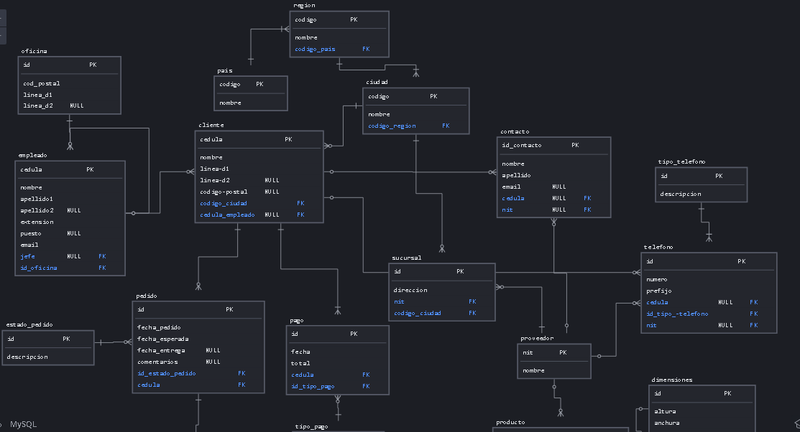
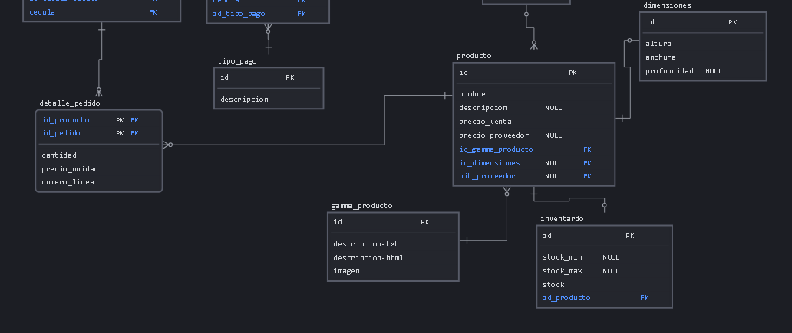

DDL

Creacion de la base de datos:

```mysql
create database tallerNormalizacion;
```

Creacion de las tablas:

```mysql
create table pais(
    id int auto_increment primary key,
    nombre varchar(100) not null
);

create table region(
	id int auto_increment primary key,
	nombre varchar(100) not null,
    id_pais int not null,
    constraint FK_id_pais foreign key(id_pais) references pais(id)
);

create table ciudad(
	id int auto_increment primary key,
	nombre varchar(100) not null,
	id_region int  not null,
	constraint FK_id_region foreign key(id_region) references 		region(id)
);

create table oficina(
	id int auto_increment primary key,
    cod_postal int(6) not null,
    linea_d1 varchar(100) not null,
    linea_d2 varchar(100),
    id_ciudad int,
    constraint FK_id_ciudad_oficina foreign key(id_ciudad) references ciudad(id)
);

create table empleado(
	cedula int not null primary key,
    nombre varchar(100) not null,
    apellido1 varchar(100) not null,
    apellido2 varchar(100),
    extension int(5) not null,
    puesto varchar(100),
    email varchar(100) not null,
    jefe int,
    id_oficina int,
    constraint FK_cedula_jefe foreign key(jefe) references empleado(cedula),
    constraint FK_id_oficina foreign key(id_oficina) references oficina(id)
);

create table cliente(
    cedula int(10) primary key,
	nombre varchar(100) not null,
	linea_d1 varchar(100) not null,
    linea_d2 varchar(100),
    id_ciudad int not null,
    cedula_empleado int,
    constraint FK_id_ciudad_cliente foreign key(id_ciudad) references ciudad(id),
    constraint FK_id_empleado foreign key(cedula_empleado) references empleado(cedula)
);

create table proveedor(
	nit int(9) primary key,
    nombre varchar(100) not null
);

create table sucursal(
	id int auto_increment primary key,
    direccion varchar(100) not null,
    nit_proveedor int not null,
    id_ciudad int not null,
    constraint FK_nit_proveedor_sucursal foreign key(nit_proveedor) references proveedor(nit),
    constraint FK_id_ciudad_sucursal foreign key(id_ciudad) references ciudad(id)
);

create table tipo_telefono(
	id int auto_increment primary key,
    descripcion varchar(100) not null
);

create table telefono(
	id int auto_increment primary key,
    numero int(15) not null,
    prefijo int(5) not null,
    cedula_cliente int(10) null,
    id_tipo_telefono int not null,
    nit_proveedor int(9) null,
    id_oficina int null,
    constraint FK_id_oficina foreign key(id_oficina) references oficina(id),
    constraint FK_cedula_cliente_telefono foreign key(cedula_cliente) references cliente(cedula),
    constraint FK_nit_proveedor_telefono foreign key(nit_proveedor) references proveedor(nit),
    constraint FK_id_tipo_telefono foreign key(id_tipo_telefono) references tipo_telefono(id)
);

create table tipo_pago(
	id int auto_increment primary key,
    descripcion varchar(100) not null
);

create table pago(
	id int auto_increment primary key,
    fecha date not null,
    total double not null,
    cedula_cliente int(10) not null,
    id_tipo_pago int not null,
    constraint FK_cedula_cliente_pago foreign key(cedula_cliente) references cliente(cedula),
    constraint FK_id_tipo_pago foreign key(id_tipo_pago) references tipo_pago(id)
);

create table contacto(
	id int auto_increment primary key,
    nombre varchar(100) not null,
    apellido varchar(100) not null,
    email varchar(50) null,
    cedula_cliente int(10) null,
    nit_proveedor int(9) null,
    constraint FK_cedula_cliente_contacto foreign key(cedula_cliente) references cliente(cedula),
    constraint FK_nit_proveedor_contacto foreign key(nit_proveedor) references proveedor(nit)
);

create table estado_pedido(
	id int auto_increment primary key,
    descripcion varchar(100) not null 
);

create table gamma_producto(
	id int auto_increment primary key,
    descripcion_txt varchar(200) not null,
    descripcion_html varchar(200) not null,
    imagen varchar(100) not null
);

create table dimensiones(
	id int auto_increment primary key,
    largo int(4) not null,
    ancho int(4) not null,
    alto int(4) null
);

create table producto(
	id int auto_increment primary key,
    nombre varchar(100) not null,
    descripcion varchar(200) null,
    precio_venta double not null,
    precio_proveedor double null,
    id_gamma_producto int not null,
    id_dimensiones int null,
    nit_proveedor int(9) null,
    constraint FK_id_gamma_producto foreign key(id_gamma_producto) references gamma_producto(id),
    constraint FK_id_dimensiones foreign key(id_dimensiones) references dimensiones(id),
    constraint FK_nit_proveedor_prodcuto foreign key(nit_proveedor) references proveedor(nit)
);

create table inventario(
	id int auto_increment primary key,
    stock_mininmo int(6) null,
    stock_maximo int(6) null,
    stock_actual int(6) not null,
    id_producto int not null,
    constraint FK_id_producto_inventario foreign key(id_producto) references producto(id)
);

create table pedido(
	id int auto_increment primary key,
    fecha_pedido date not null,
    fecha_esperada date not null,
    fecha_entrega date null,
    comentarios varchar(200) null,
    id_estado_pedido int not null,
    cedula_cliente int(10) not null,
    constraint FK_cedula_cliente_peido foreign key(cedula_cliente) references cliente(cedula),
    constraint FK_id_estado_pedido foreign key(id_estado_pedido) references estado_pedido(id)
);

create table detalle_pedido(
	id_producto int not null,
    id_pedido int not null,
    cantidad int(6) not null,
    precio_unidad double not null,
    numero_linea int(6) not null,
    primary key(id_producto,id_pedido),
    constraint FK_id_producto_detalle_pedido foreign key(id_producto) references producto(id),
    constraint FK_id_pedido_detalle_pedido foreign key(id_pedido) references pedido(id)
);
```


**DML**

**INSERT**

```mysql
-- Países
INSERT INTO pais (nombre) VALUES 
('España'), 
('Francia'), 
('Alemania'), 
('Italia'), 
('Portugal'), 
('Reino Unido'), 
('Suiza'), 
('Suecia'), 
('Noruega'), 
('Finlandia');

-- Regiones
INSERT INTO region (nombre, id_pais) VALUES 
('Comunidad de Madrid', 1), 
('Cataluña', 1), 
('Île-de-France', 2), 
('Baviera', 3), 
('Lombardía', 4), 
('Lisboa', 5), 
('Inglaterra', 6), 
('Zurich', 7), 
('Estocolmo', 8), 
('Oslo', 9);

-- Ciudades
INSERT INTO ciudad (nombre, id_region) VALUES 
('Madrid', 1), 
('Barcelona', 1), 
('París', 3), 
('Munich', 4), 
('Milán', 5), 
('Lisboa', 6), 
('Londres', 7), 
('Zúrich', 8), 
('Estocolmo', 9), 
('Oslo', 10);

-- Oficinas
INSERT INTO oficina (cod_postal, linea_d1, id_ciudad) VALUES 
(28001, 'Calle Gran Vía, 10', 1), 
(08001, 'Calle Diagonal, 20', 2), 
(75001, 'Avenue des Champs-Élysées, 30', 3), 
(80333, 'Karlstraße, 40', 4), 
(20121, 'Via Montenapoleone, 50', 5), 
(1000, 'Rua Augusta, 60', 6), 
(1213, 'Fleet Street, 70', 7), 
(8001, 'Bahnhofstrasse, 80', 8),
(11446, 'Sveavägen, 90', 9), 
(167, 'Karl Johans gate, 100', 10);

-- Empleados
INSERT INTO empleado (cedula, nombre, apellido1, apellido2, extension, puesto, email, jefe, id_oficina) VALUES 
(1234567890, 'Juan', 'González', 'Pérez', 12345, 'Gerente', 'juan@email.com', NULL, 1), 
(1234567891, 'María', 'López', 'Martínez', 23456, 'Vendedor', 'maria@email.com', 1234567890, 2), 
(1234567892, 'Carlos', 'Rodríguez', 'Gómez', 34567, 'Asistente', 'carlos@email.com', 1234567890, 1), 
(1234567893, 'Ana', 'Sánchez', 'García', 45678, 'Contador', 'ana@email.com', 1234567890, 2), 
(1234567894, 'Pedro', 'Martín', 'Fernández', 56789, 'Desarrollador', 'pedro@email.com', 1234567891, 1), 
(1234567895, 'Sara', 'Díaz', 'Álvarez', 67890, 'Analista', 'sara@email.com', 1234567891, 2), 
(1234567896, 'Luis', 'Ruiz', 'Jiménez', 78901, 'Diseñador', 'luis@email.com', 1234567890, 1), 
(1234567897, 'Elena', 'Pérez', 'Romero', 89012, 'Marketing', 'elena@email.com', 1234567890, 2),
(1234567898, 'Diego', 'Gómez', 'Hernández', 90123, 'Recepcionista', 'diego@email.com', 1234567892, 1), 
(1234567899, 'Laura', 'Fernández', 'Díaz', 12345, 'Recursos Humanos', 'laura@email.com', 1234567892, 2);

-- Clientes
INSERT INTO cliente (cedula, nombre, linea_d1, linea_d2, id_ciudad, cedula_empleado) VALUES 
(1122334455, 'John Doe', 'Calle 123', 'Piso 4', 1, 1234567890), 
(1122334456, 'Jane Smith', 'Avenida 456', 'Apartamento 2B', 2, 1234567891), 
(1122334457, 'Michael Johnson', 'Carrera 789', NULL, 3, 1234567892), 
(1122334458, 'Emily Davis', 'Calle 012', 'Oficina 7', 1, 1234567893), 
(1122334459, 'William Martinez', 'Avenida XYZ', 'Piso 10', 2, 1234567894), 
(1122334460, 'Sarah Brown', 'Calle 345', 'Apartamento 5A', 3, 1234567895), 
(1122334461, 'David Wilson', 'Carrera 678', NULL, 1, 1234567896), 
(1122334462, 'Olivia Taylor', 'Avenida 901', 'Oficina 3B', 2, 1234567897), 
(1122334463, 'Emma Anderson', 'Calle UVW', 'Piso 8', 3, 1234567898), 
(1122334464, 'James Wilson', 'Avenida 234', 'Apartamento 12C', 1, 1234567899);


-- Proveedores
INSERT INTO proveedor (nit, nombre) VALUES 
(123456789, 'Acme Corporation'),
(234567890, 'Smith & Co.'),
(345678901, 'Johnson Enterprises'),
(456789012, 'Martinez Ltd.'),
(567890123, 'Brown Industries'),
(678901234, 'Taylor Group'),
(789012345, 'Wilson & Sons'),
(890123456, 'Anderson Supplies'),
(901234567, 'Taylor & Martinez'),
(101234567, 'Johnson Corp.');


-- Sucursales
INSERT INTO sucursal (direccion, nit_proveedor, id_ciudad) VALUES 
('Calle 123, Local 1', 123456789, 1),
('Avenida 456, Piso 2', 234567890, 2),
('Carrera 789, Edificio A', 345678901, 3),
('Avenida XYZ, Torre B', 456789012, 1),
('Calle UVW, Bloque 3', 567890123, 2),
('Carrera 678, Oficina 5', 678901234, 3),
('Avenida 901, Local 10', 789012345, 1),
('Calle 012, Piso 3', 890123456, 2),
('Avenida 234, Edificio C', 901234567, 3),
('Calle 345, Torre D', 101234567, 1);


-- Tipo de Teléfono
INSERT INTO tipo_telefono (descripcion) VALUES 
('Móvil'), 
('Fijo'), 
('Fax'), 
('Trabajo'), 
('Casa');

-- Inserts de teléfonos para proveedores
INSERT INTO telefono (numero, prefijo, id_tipo_telefono, nit_proveedor)
VALUES 
(612345678, 1, 1, 101234567), -- Teléfono del proveedor Johnson Corp.
(623456789, 1, 2, 123456789), -- Teléfono del proveedor Acme Corporation
(634567890, 1, 1, 234567890), -- Teléfono del proveedor Smith & Co.
(645678901, 1, 2, 345678901), -- Teléfono del proveedor Johnson Enterprises
(656789012, 1, 1, 456789012), -- Teléfono del proveedor Martinez Ltd.
(667890123, 1, 2, 567890123), -- Teléfono del proveedor Brown Industries
(678901234, 1, 1, 678901234), -- Teléfono del proveedor Taylor Group
(689012345, 1, 2, 789012345), -- Teléfono del proveedor Wilson & Sons
(690123456, 1, 1, 890123456), -- Teléfono del proveedor Anderson Supplies
(601234567, 1, 2, 901234567); -- Teléfono del proveedor Taylor & Martinez

-- Inserts de teléfonos para oficinas
INSERT INTO telefono (numero, prefijo, id_tipo_telefono, id_oficina)
VALUES 
(912345678, 34, 1, 1), -- Teléfono de la oficina 1
(934567890, 34, 2, 2), -- Teléfono de la oficina 2
(945678901, 34, 1, 3), -- Teléfono de la oficina 3
(956789012, 34, 2, 4), -- Teléfono de la oficina 4
(967890123, 34, 1, 5), -- Teléfono de la oficina 5
(978901234, 34, 2, 6), -- Teléfono de la oficina 6
(989012345, 34, 1, 7), -- Teléfono de la oficina 7
(990123456, 34, 2, 8), -- Teléfono de la oficina 8
(901234567, 34, 1, 9), -- Teléfono de la oficina 9
(912345678, 34, 2, 10); -- Teléfono de la oficina 10

-- Inserts de teléfonos para clientes
INSERT INTO telefono (numero, prefijo, cedula_cliente, id_tipo_telefono)
VALUES 
(12345678, 57, 1122334455, 1), -- Teléfono de John Doe
(23456789, 57, 1122334456, 2), -- Teléfono de Jane Smith
(34567890, 57, 1122334457, 1), -- Teléfono de Michael Johnson
(45678901, 57, 1122334458, 1), -- Teléfono de Emily Davis
(56789012, 57, 1122334459, 2), -- Teléfono de William Martinez
(67890123, 57, 1122334460, 1), -- Teléfono de Sarah Brown
(78901234, 57, 1122334461, 1), -- Teléfono de David Wilson
(89012345, 57, 1122334462, 2), -- Teléfono de Olivia Taylor
(90123456, 57, 1122334463, 1), -- Teléfono de Emma Anderson
(12345678, 57, 1122334464, 2); -- Teléfono de James Wilson

-- Tipos de Pago
INSERT INTO tipo_pago (descripcion) VALUES 
('Efectivo'), 
('Tarjeta de Crédito'), 
('Transferencia Bancaria'), 
('PayPal'), 
('Cheque');

-- Pagos
INSERT INTO pago (fecha, total, cedula_cliente, id_tipo_pago) VALUES 
('2024-04-20', 150.00, 1122334455, 1),
('2024-04-19', 200.00, 1122334456, 2),
('2024-04-18', 100.00, 1122334457, 1),
('2024-04-17', 250.00, 1122334458, 2),
('2024-04-16', 300.00, 1122334459, 1),
('2024-04-15', 400.00, 1122334460, 2),
('2024-04-14', 200.00, 1122334461, 1),
('2024-04-13', 150.00, 1122334462, 2),
('2024-04-12', 100.00, 1122334463, 1),
('2024-04-11', 50.00, 1122334464, 2);


-- Contactos
INSERT INTO contacto (nombre, apellido, email, cedula_cliente, nit_proveedor) VALUES 
('Juan', 'Perez', 'juan.perez@example.com', 1122334455, NULL),
('Ana', 'Gomez', 'ana.gomez@example.com', 1122334456, NULL),
('Pedro', 'Rodriguez', 'pedro.rodriguez@example.com', 1122334457, NULL),
('Maria', 'Lopez', 'maria.lopez@example.com', 1122334458, NULL),
('Luis', 'Garcia', 'luis.garcia@example.com', 1122334459, NULL),
('Laura', 'Martinez', 'laura.martinez@example.com', 1122334460, NULL),
('Carlos', 'Sanchez', 'carlos.sanchez@example.com', 1122334461, NULL),
('Sofia', 'Diaz', 'sofia.diaz@example.com', 1122334462, NULL),
('Pablo', 'Hernandez', 'pablo.hernandez@example.com', 1122334463, NULL),
('Elena', 'Torres', 'elena.torres@example.com', 1122334464, NULL),
('Manuel', 'Gutierrez', 'manuel.gutierrez@example.com', NULL, 123456789),
('Marta', 'Fernandez', 'marta.fernandez@example.com', NULL, 234567890),
('Roberto', 'Ruiz', 'roberto.ruiz@example.com', NULL, 345678901),
('Carmen', 'Santos', 'carmen.santos@example.com', NULL, 456789012),
('Javier', 'Morales', 'javier.morales@example.com', NULL, 567890123),
('Isabel', 'Jimenez', 'isabel.jimenez@example.com', NULL, 678901234),
('Diego', 'Alvarez', 'diego.alvarez@example.com', NULL, 789012345),
('Lucia', 'Nunez', 'lucia.nunez@example.com', NULL, 890123456),
('Eva', 'Garcia', 'eva.garcia@example.com', NULL, 901234567),
('Antonio', 'Romero', 'antonio.romero@example.com', NULL, 101234567);


-- Estados de Pedido
INSERT INTO estado_pedido (descripcion) VALUES 
('En Proceso'), 
('En Ruta'), 
('Entregado'), 
('Cancelado');

-- Gamas de Producto
INSERT INTO gamma_producto (descripcion_txt, descripcion_html, imagen) VALUES 
('Electrónica', '<b>Electrónica</b>', 'electronica.jpg'), 
('Ropa', '<b>Ropa</b>', 'ropa.jpg'), 
('Hogar', '<b>Hogar</b>', 'hogar.jpg'), 
('Alimentación', '<b>Alimentación</b>', 'alimentacion.jpg'), 
('Belleza', '<b>Belleza</b>', 'belleza.jpg'), 
('Deporte', '<b>Deporte</b>', 'deporte.jpg'), 
('Juguetes', '<b>Juguetes</b>', 'juguetes.jpg'), 
('Libros', '<b>Libros</b>', 'libros.jpg'), 
('Herramientas', '<b>Herramientas</b>', 'herramientas.jpg'), 
('Automoción', '<b>Automoción</b>', 'automocion.jpg');

-- Dimensiones
INSERT INTO dimensiones (largo, ancho, alto) VALUES 
(10, 20, 5), 
(30, 40, 15), 
(20, 15, 10), 
(25, 35, 20), 
(40, 30, 25), 
(15, 25, 10), 
(35, 45, 30), 
(50, 40, 35), 
(45, 55, 25), 
(60, 50, 40);

-- Productos
INSERT INTO producto (nombre, descripcion, precio_venta, precio_proveedor, id_gamma_producto, id_dimensiones, nit_proveedor) VALUES 
('Laptop Lenovo', 'Portátil de alto rendimiento', 1200.00, 900.00, 1, 1, 123456789),
('Smartphone Samsung', 'Teléfono inteligente con pantalla OLED', 800.00, 600.00, 2, 2, 234567890),
('TV Sony', 'Televisor 4K de última generación', 1500.00, 1200.00, 3, 3, 345678901),
('Impresora HP', 'Impresora multifuncional inalámbrica', 300.00, 200.00, 1, 1, 456789012),
('Tablet Apple', 'Tableta con pantalla Retina', 700.00, 500.00, 2, 2, 567890123),
('Monitor Dell', 'Monitor de alta definición', 400.00, 300.00, 3, 3, 678901234),
('Altavoces Logitech', 'Sistema de altavoces envolvente', 150.00, 100.00, 1, 1, 789012345),
('Cámara Canon', 'Cámara réflex digital profesional', 1000.00, 800.00, 2, 2, 890123456),
('Router TP-Link', 'Router Wi-Fi de doble banda', 80.00, 50.00, 3, 3, 901234567),
('Teclado Razer', 'Teclado mecánico para gaming', 120.00, 90.00, 1, 1, 101234567);


-- Inventario
INSERT INTO inventario (stock_mininmo, stock_maximo, stock_actual, id_producto) VALUES 
(10, 100, 50, 1), 
(20, 200, 100, 2), 
(5, 50, 20, 3), 
(30, 300, 150, 4), 
(15, 150, 80, 5), 
(25, 250, 120, 6), 
(8, 80, 40, 7), 
(40, 400, 200, 8),
(12, 120, 60, 9), 
(50, 500, 250, 10);

-- Pedidos
INSERT INTO pedido (fecha_pedido, fecha_esperada, fecha_entrega, comentarios, id_estado_pedido, cedula_cliente) VALUES 
('2024-04-01', '2024-04-08', '2024-04-09', 'Pedido urgente', 1, 1122334455),
('2024-04-02', '2024-04-09', NULL, 'Envío pendiente de confirmación', 2, 1122334456),
('2024-04-03', '2024-04-10', '2024-04-11', NULL, 3, 1122334457),
('2024-04-04', '2024-04-11', NULL, 'Productos agotados, se reprogramará entrega', 1, 1122334458),
('2024-04-05', '2024-04-12', '2024-04-14', 'Pedido para evento corporativo', 2, 1122334459),
('2024-04-06', '2024-04-13', NULL, 'Envío retrasado por condiciones climáticas', 3, 1122334460),
('2024-04-07', '2024-04-14', '2024-04-15', NULL, 1, 1122334461),
('2024-04-08', '2024-04-15', '2024-04-16', 'Entrega confirmada por el cliente', 2, 1122334462),
('2024-04-09', '2024-04-16', NULL, 'Productos dañados en tránsito, se solicita reemplazo', 3, 1122334463),
('2024-04-10', '2024-04-17', '2024-04-18', 'Pedido estándar', 1, 1122334464);


-- Detalles de Pedido
INSERT INTO detalle_pedido (id_producto, id_pedido, cantidad, precio_unidad, numero_linea) VALUES 
(1, 1, 2, 250.00, 1), 
(2, 2, 3, 30.00, 2), 
(3, 3, 1, 150.00, 3), 
(4, 4, 5, 10.00, 4), 
(5, 5, 2, 20.00, 5), 
(6, 6, 3, 25.00, 6), 
(7, 7, 1, 50.00, 7), 
(8, 8, 4, 15.00, 8),
(9, 9, 2, 80.00, 9), 
(10, 10, 3, 100.00, 10);
```

**Consultas sobre una tabla**

1. Devuelve un listado con el código de oficina y la ciudad donde hay oficinas.

   ```mysql
   select o.id as "Codigo Oficina", c.nombre from oficina o join ciudad c on o.id_ciudad = c.id
   ```

   

2. Devuelve un listado con la ciudad y el teléfono de las oficinas de España.

   

   ```mysql
   
   ```

   

3. Devuelve un listado con el nombre, apellidos y email de los empleados cuyo
   jefe tiene un código de jefe igual a 7.

   

   ```mysql
   
   ```

   

4. Devuelve el nombre del puesto, nombre, apellidos y email del jefe de la
   empresa.

   

   ```mysql
   
   ```

   

5. Devuelve un listado con el nombre, apellidos y puesto de aquellos
   empleados que no sean representantes de ventas.

   

   ```mysql
   
   ```

   

6. Devuelve un listado con el nombre de los todos los clientes españoles.

   

   ```mysql
   
   ```

   

7. Devuelve un listado con los distintos estados por los que puede pasar un
   pedido.

   

   ```mysql
   
   ```

   

8. Devuelve un listado con el código de cliente de aquellos clientes que
   realizaron algún pago en 2008. Tenga en cuenta que deberá eliminar
   aquellos códigos de cliente que aparezcan repetidos. Resuelva la consulta:
   • Utilizando la función YEAR de MySQL.
   • Utilizando la función DATE_FORMAT de MySQL.
   • Sin utilizar ninguna de las funciones anteriores.

   

   ```mysql
   
   ```

   

9. Devuelve un listado con el código de pedido, código de cliente, fecha
   esperada y fecha de entrega de los pedidos que no han sido entregados a
   tiempo.

   

   ```mysql
   
   ```

   

10. Devuelve un listado con el código de pedido, código de cliente, fecha
    esperada y fecha de entrega de los pedidos cuya fecha de entrega ha sido al
    menos dos días antes de la fecha esperada.
    • Utilizando la función ADDDATE de MySQL.
    • Utilizando la función DATEDIFF de MySQL.
    • ¿Sería posible resolver esta consulta utilizando el operador de suma + o
    resta -?

    

    ```mysql
    
    ```

    

11. Devuelve un listado de todos los pedidos que fueron rechazados en 2009.

    

    ```mysql
    
    ```

    

12. Devuelve un listado de todos los pedidos que han sido entregados en el
    mes de enero de cualquier año.

    

    ```mysql
    
    ```

    

13. Devuelve un listado con todos los pagos que se realizaron en el
    año 2008 mediante Paypal. Ordene el resultado de mayor a menor.

    

    ```mysql
    
    ```

    

14. Devuelve un listado con todas las formas de pago que aparecen en la
    tabla pago. Tenga en cuenta que no deben aparecer formas de pago
    repetidas.

    

    ```mysql
    
    ```

    

15. Devuelve un listado con todos los productos que pertenecen a la
    gama Ornamentales y que tienen más de 100 unidades en stock. El listado
    deberá estar ordenado por su precio de venta, mostrando en primer lugar
    los de mayor precio.

    

    ```mysql
    
    ```

    

16. Devuelve un listado con todos los clientes que sean de la ciudad de Madrid y
    cuyo representante de ventas tenga el código de empleado 11 o 30.

    

    ```mysql
    
    ```

    

**Consultas multitabla (Composición interna)**
**Resuelva todas las consultas utilizando la sintaxis de SQL1 y SQL2. Las consultas con**
**sintaxis de SQL2 se deben resolver con INNER JOIN y NATURAL JOIN.**

1. Obtén un listado con el nombre de cada cliente y el nombre y apellido de su
   representante de ventas.

   

   ```mysql
   
   ```

   

2. Muestra el nombre de los clientes que hayan realizado pagos junto con el
   nombre de sus representantes de ventas.

   

   ```mysql
   
   ```

   

3. Muestra el nombre de los clientes que no hayan realizado pagos junto con
   el nombre de sus representantes de ventas.

   

   ```mysql
   
   ```

   

4. Devuelve el nombre de los clientes que han hecho pagos y el nombre de sus
   representantes junto con la ciudad de la oficina a la que pertenece el
   representante.

   

   ```mysql
   
   ```

   

5. Devuelve el nombre de los clientes que no hayan hecho pagos y el nombre
   de sus representantes junto con la ciudad de la oficina a la que pertenece el
   representante.

   

   ```mysql
   
   ```

   

6. Lista la dirección de las oficinas que tengan clientes en Fuenlabrada.

   

   ```mysql
   
   ```

   

7. Devuelve el nombre de los clientes y el nombre de sus representantes junto
   con la ciudad de la oficina a la que pertenece el representante.

   

   ```mysql
   
   ```

   

8. Devuelve un listado con el nombre de los empleados junto con el nombre
   de sus jefes.

   

   ```mysql
   
   ```

   

9. Devuelve un listado que muestre el nombre de cada empleados, el nombre
   de su jefe y el nombre del jefe de sus jefe.

   

   ```mysql
   
   ```

   

10. Devuelve el nombre de los clientes a los que no se les ha entregado a
    tiempo un pedido.

    

    ```mysql
    
    ```

    

11. Devuelve un listado de las diferentes gamas de producto que ha comprado
    cada cliente.
    Consultas multitabla (Composición externa)
    Resuelva todas las consultas utilizando las cláusulas LEFT JOIN, RIGHT JOIN, NATURAL
    LEFT JOIN y NATURAL RIGHT JOIN.

    

    ```mysql
    
    ```

    

12. Devuelve un listado que muestre solamente los clientes que no han
    realizado ningún pago.

    

    ```mysql
    
    ```

    

13. Devuelve un listado que muestre solamente los clientes que no han
    realizado ningún pedido.

    

    ```mysql
    
    ```

    

14. Devuelve un listado que muestre los clientes que no han realizado ningún
    pago y los que no han realizado ningún pedido.

    

    ```mysql
    
    ```

    

15. Devuelve un listado que muestre solamente los empleados que no tienen
    una oficina asociada.

    

    ```mysql
    
    ```

    

16. Devuelve un listado que muestre solamente los empleados que no tienen un
    cliente asociado.

    

    ```mysql
    
    ```

    

17. Devuelve un listado que muestre solamente los empleados que no tienen un
    cliente asociado junto con los datos de la oficina donde trabajan.

    

    ```mysql
    
    ```

    

18. Devuelve un listado que muestre los empleados que no tienen una oficina
    asociada y los que no tienen un cliente asociado.

    

    ```mysql
    
    ```

    

19. Devuelve un listado de los productos que nunca han aparecido en un
    pedido.

    

    ```mysql
    
    ```

    

20. Devuelve un listado de los productos que nunca han aparecido en un
    pedido. El resultado debe mostrar el nombre, la descripción y la imagen del
    producto.

    

    ```mysql
    
    ```

    

21. Devuelve las oficinas donde no trabajan ninguno de los empleados que
    hayan sido los representantes de ventas de algún cliente que haya realizado
    la compra de algún producto de la gama Frutales.

    

    ```mysql
    
    ```

    

22. Devuelve un listado con los clientes que han realizado algún pedido pero no
    han realizado ningún pago.

    

    ```mysql
    
    ```

    

23. Devuelve un listado con los datos de los empleados que no tienen clientes
    asociados y el nombre de su jefe asociado.
    Consultas resumen

    

    ```mysql
    
    ```

    

24. ¿Cuántos empleados hay en la compañía?

    

    ```mysql
    
    ```

    

25. ¿Cuántos clientes tiene cada país?

    

    ```mysql
    
    ```

    

26. ¿Cuál fue el pago medio en 2009?

    

    ```mysql
    
    ```

    

27. ¿Cuántos pedidos hay en cada estado? Ordena el resultado de forma
    descendente por el número de pedidos.

    

    ```mysql
    
    ```

    

28. Calcula el precio de venta del producto más caro y más barato en una
    misma consulta.

    

    ```mysql
    
    ```

    

29. Calcula el número de clientes que tiene la empresa.

    

    ```mysql
    
    ```

    

30. ¿Cuántos clientes existen con domicilio en la ciudad de Madrid?

    

    ```mysql
    
    ```

    

31. ¿Calcula cuántos clientes tiene cada una de las ciudades que empiezan
    por M?

    

    ```mysql
    
    ```

    

32. Devuelve el nombre de los representantes de ventas y el número de clientes
    al que atiende cada uno.

    

    ```mysql
    
    ```

    

33. Calcula el número de clientes que no tiene asignado representante de
    ventas.

    

    ```mysql
    
    ```

    

34. Calcula la fecha del primer y último pago realizado por cada uno de los
    clientes. El listado deberá mostrar el nombre y los apellidos de cada cliente.

    

    ```mysql
    
    ```

    

35. Calcula el número de productos diferentes que hay en cada uno de los
    pedidos.

    

    ```mysql
    
    ```

    

36. Calcula la suma de la cantidad total de todos los productos que aparecen en
    cada uno de los pedidos.

    

    ```mysql
    
    ```

    

37. Devuelve un listado de los 20 productos más vendidos y el número total de
    unidades que se han vendido de cada uno. El listado deberá estar ordenado
    por el número total de unidades vendidas.

    

    ```mysql
    
    ```

    

38. La facturación que ha tenido la empresa en toda la historia, indicando la
    base imponible, el IVA y el total facturado. La base imponible se calcula
    sumando el coste del producto por el número de unidades vendidas de la
    tabla detalle_pedido. El IVA es el 21 % de la base imponible, y el total la
    suma de los dos campos anteriores.

    

    ```mysql
    
    ```

    

39. La misma información que en la pregunta anterior, pero agrupada por
    código de producto.

    

    ```mysql
    
    ```

    

40. La misma información que en la pregunta anterior, pero agrupada por
    código de producto filtrada por los códigos que empiecen por OR.

    

    ```mysql
    
    ```

    

41. Lista las ventas totales de los productos que hayan facturado más de 3000
    euros. Se mostrará el nombre, unidades vendidas, total facturado y total
    facturado con impuestos (21% IVA).

    

    ```mysql
    
    ```

    

42. Muestre la suma total de todos los pagos que se realizaron para cada uno
    de los años que aparecen en la tabla pagos.

    

    ```mysql
    
    ```

    

**Consultas variadas**

1. Devuelve el listado de clientes indicando el nombre del cliente y cuántos
   pedidos ha realizado. Tenga en cuenta que pueden existir clientes que no
   han realizado ningún pedido.

   

   ```mysql
   
   ```

   

2. Devuelve un listado con los nombres de los clientes y el total pagado por
   cada uno de ellos. Tenga en cuenta que pueden existir clientes que no han
   realizado ningún pago.

   

   ```mysql
   
   ```

   

3. Devuelve el nombre de los clientes que hayan hecho pedidos en 2008
   ordenados alfabéticamente de menor a mayor.

   

   ```mysql
   
   ```

   

4. Devuelve el nombre del cliente, el nombre y primer apellido de su
   representante de ventas y el número de teléfono de la oficina del                                                                                                                    representante de ventas, de aquellos clientes que no hayan realizado ningún
   pago.

   

   ```mysql
   
   ```

   

5. Devuelve el listado de clientes donde aparezca el nombre del cliente, el
   nombre y primer apellido de su representante de ventas y la ciudad donde
   está su oficina.

   

   ```mysql
   
   ```

   

6. Devuelve el nombre, apellidos, puesto y teléfono de la oficina de aquellos
   empleados que no sean representante de ventas de ningún cliente.

   

   ```mysql
   
   ```

   

7. Devuelve un listado indicando todas las ciudades donde hay oficinas y el
   número de empleados que tiene.

   

   ```mysql
   
   ```

   
